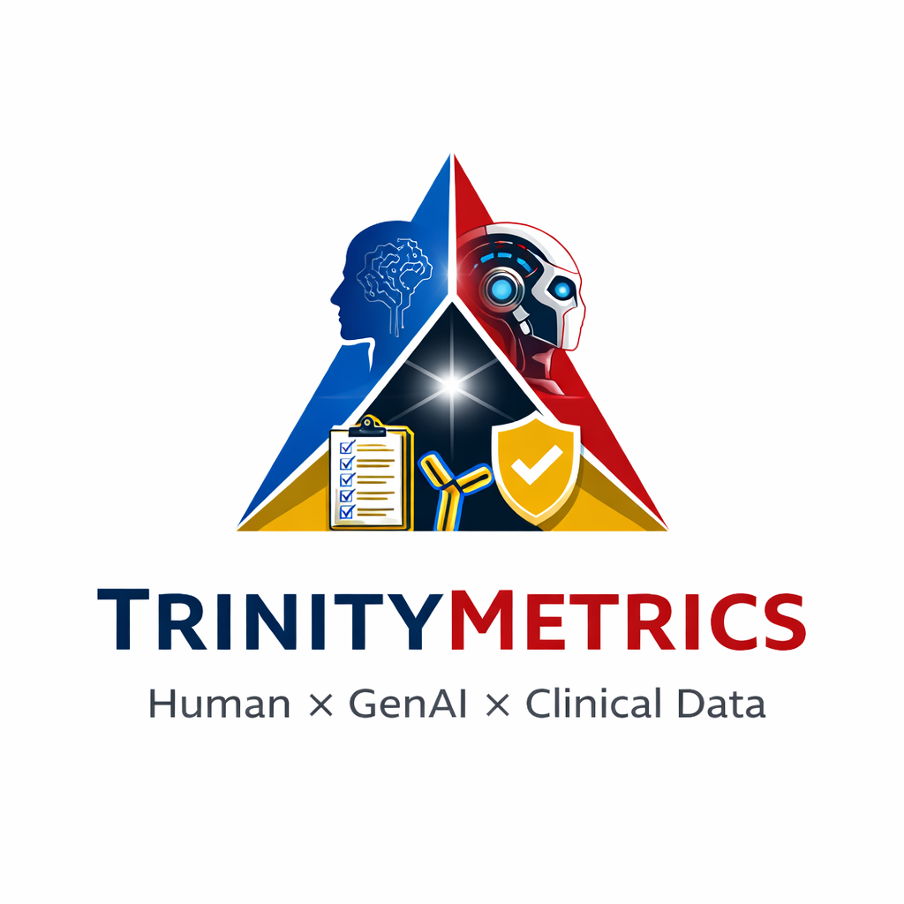

# TrinityMetrics

AI, reproducibility, and regulated scientific workflows.

TrinityMetrics explores how biostatisticians, pharmacometricians, and clinical data scientists can use modern AI tools without weakening accountability, reproducibility, or data integrity.

## What this site is for

This site is the public-facing layer of the repository.

It brings together:

- practical writing on AI in regulated scientific work
- code and workflow templates
- synthetic data patterns for safe experimentation
- reusable skill files and evaluation checklists

## Navigate the site

### Blog

Short essays, practical notes, and position-setting pieces about using AI in real scientific workflows.

### Resources
P
Reference documents, checklists, and implementation-oriented materials that support reviewable work.

### Code

Repository structure, reusable materials, worked examples, and technical assets that support the writing.

### About

Project scope, intended audience, and the working principles behind TrinityMetrics.

## Current publishing plan

The initial public launch is planned around two complementary posts:

- a short philosophy post on AI assistance and human decision ownership
- a practical post on synthetic data workflows

That pairing should make the purpose of the repository clear from the start.

## What to expect

### AI in regulated workflows

The focus is not on generic AI enthusiasm.

The focus is on where AI is useful inside real clinical and pharmacometric workflows that have constraints, review requirements, and consequences.

### Transparent reasoning

The repository emphasizes visible reasoning, explicit claims, and reviewable outputs.

### Reusable materials

Over time, the repository can grow into a collection of:

- example analyses
- workflow templates
- synthetic data utilities
- skill and context files for specialized tasks

## Near-term areas of development

- synthetic data generation for model-oriented workflows
- evaluation patterns for AI-assisted analyses
- project structure templates for regulated work
- skill files for reviewing fits, graphics, and applications
