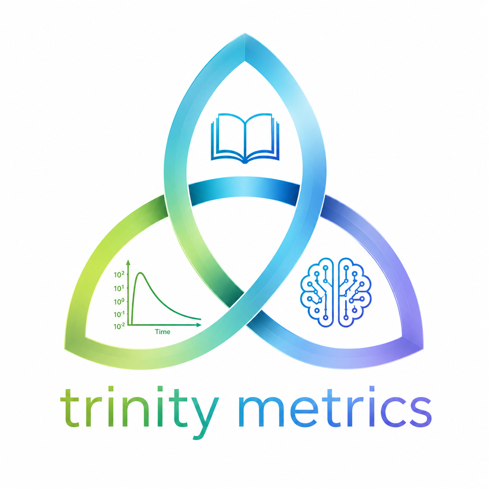

TrinityMetrics combines a lifetime love of teaching and learning, 17 years of pharmacometrics experience, and a recent interest in using GenAI tools to support both education and drug development. The material on this site is organized into three categories:

::: {.legs-table}

|   |   |   |
|---|---|---|
| **Pharmacometrics** | Tools, guides, checklists and talks I've developed and contributed to, that support model-informed drug development. | [Projects](projects/index.qmd), [PMX Tools](pmx-tools.qmd), [Talks](talks.qmd) |
| **Education** | Guides and frameworks for learning and career development. | [Learning Guides](guides/index.qmd), [Tutorials](talks.qmd#tutorials) |
| **GenAI** | Project development using GenAI, skill files to support development, and a nascent blog. | [Projects](projects/index.qmd#genai), [Blog](blog/index.qmd) |

:::

:::: {.home-logo}
{fig-align="center" fig-alt="A triquetra of three interlocking loops: a pharmacokinetic time course, an open book, and a brain drawn as a circuit. Wordmark: trinity metrics."}
::::