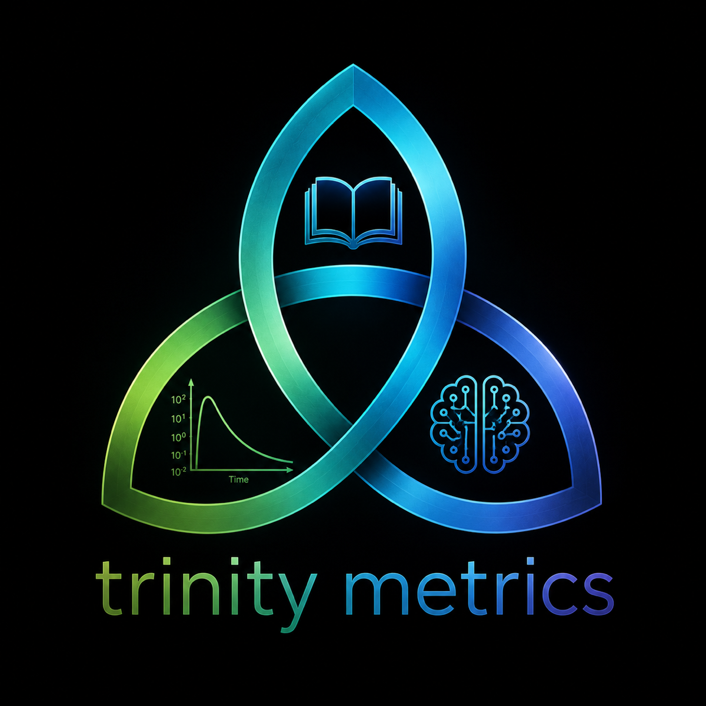

TrinityMetrics combines a lifetime love of teaching and learning, 17 years of pharmacometrics experience, and a recent interest in using GenAI tools to support both education and drug development. This site contains:

| | Holds | On this site |
|---|---|---|
| **Pharmacometrics** | Tools, guides, checklists and talks I've developed and contributed to, that support model-informed drug development. | [Projects](projects/index.qmd), [Resources](resources.qmd) |
| **Education** | Guides and frameworks for learning and career development. | [Guides](guides/index.qmd) |
| **GenAI** | Project development using GenAI, skill files to support development, and a nascent blog. | [Blog](blog/index.qmd) |

{fig-align="center" width="600px"}