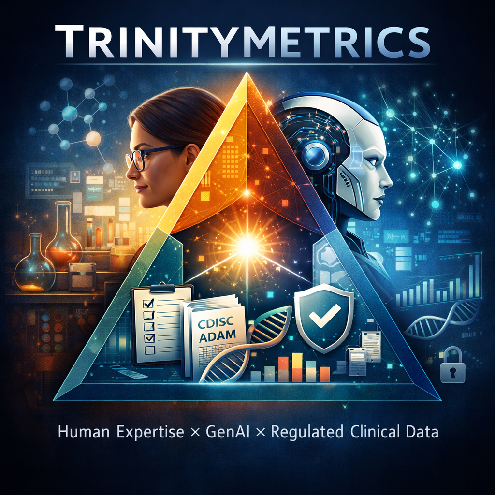

TrinityMetrics integrates three core interests.

1. **Pharmacometrics** Tools, guides, checklists and talks I've developed and contributed to, to support model-informed drug development.
2. **Education** Guides and frameworks for learning and career development.
3. **GenAI** This technology is rapidly changing the way we work, and I'm interested in learning to use it effectively while maintaining accountability, reproducibility, and data integrity.

* [Guides](guides/index.qmd): working practices, starting with how to read a paper.
* [Projects](projects/index.qmd): open-source tools and working documents for longer-running methods problems.
* [Resources](resources.qmd): documents, checklists, and implementation-oriented materials that support reviewable work.
* [Blog](blog/index.qmd): mainly about tools for making GenAI-assisted analysis more transparent and reproducible.

{fig-align="center" width="600px"}