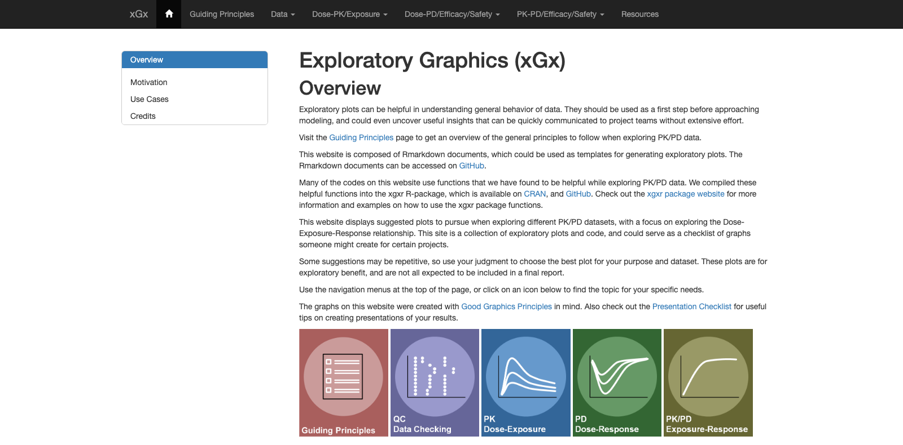
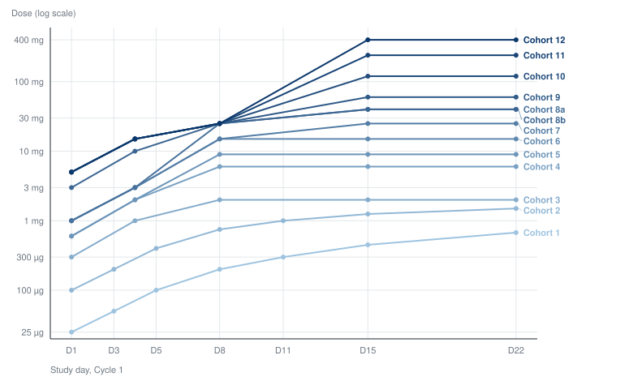
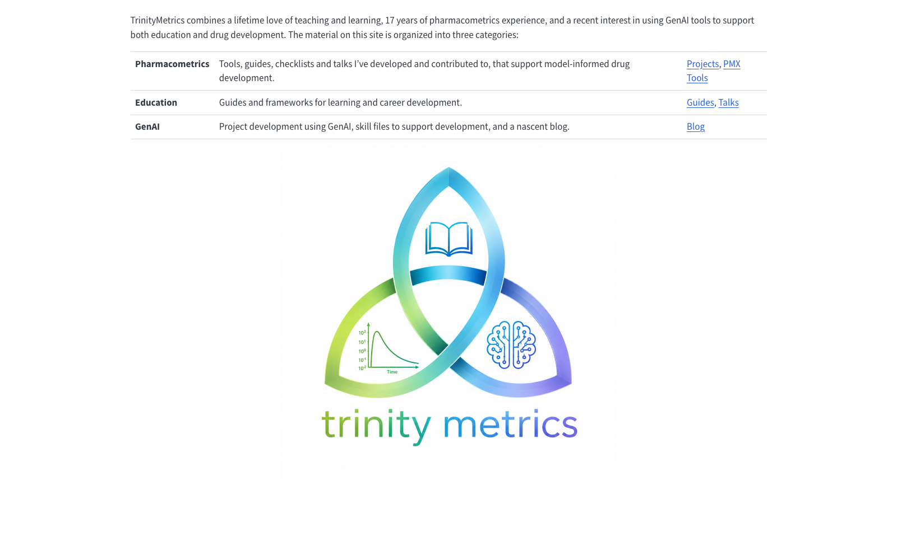

## Overview

* Four pieces of open-source work I did using Claude Code 
* When and why I use Claude Code rather than Positron
* How I set up Claude Code.

# What was built with Claude Code

- **xgxr** — fixed a user-reported bug and got the package to CRAN.
- **xgx** — rebuilt the website to publish by continuous integration.
- **synpmx** — a package for generating synthetic pharmacometrics datasets.
- **TCE-IPDE** — a specification for simulating intrapatient dose escalation.

## 1. xgxr: User reported a bug

{width="76%" fig-align="center" fig-alt="GitHub issue 72 reporting that xgx_stat_ci breaks produces incorrect binning with scale_x_log10 in ggplot2 4.0 and later."}

## 1. xgxr: Source of bug was using a hand-copied "fork" of ggplot2 function

- `xgxr::StatSummaryBinQuant` is a hand-copied fork of ggplot2's
  `stat-summary-bin.R`, pinned in its roxygen block to ggplot2 commit
  `351eb41`. It never picked up a transform step ggplot2 added later.
-  In this old version it had: `breaks <- breaks`
-  ggplot2 since changed with `breaks <- scales[[x]]$transform(breaks)`

## 1. xgxr: Fixed bug and got package ready for CRAN

- Fixed bug and then updated xgxr to 1.1.6 to CRAN (first update in 3 years)
- All CRAN checks, warnings, and notes were handled by Claude.
- Along the way it noticed a hyperlink whose TLS certificate had expired, which
  is the kind of thing CRAN rejects a submission for, and removed it unasked

## 2. xgx using Continuous Integration

**Continuous Integration (CI) via GitHub Actions publishes the site.**

- xgx was our open source website and we built it using dozens of .html files committed to github.
- A better way to work is with continuous integration (CI) that builds the site after every push so the code is in the github repository but the html is not.
- Github Actions does this and Claude Code set this up for me.
- I am not a Github expert.  In the past I relied on experts for help, but now I can quit bugging Matt and do a lot myself.

[opensource.nibr.com/xgx](https://opensource.nibr.com/xgx/)

{width="62%" fig-align="center" fig-alt="The xGx website: navigation bar, the Exploratory Graphics overview, and the row of topic icons."}

## 3. synpmx: Package for Generating Synthetic Pharmacometrics Datasets

Allows for workflows, teaching material and tooling can
be developed and shared without exposing real clinical data.

This is still a work in progress, with three different synthetic data generators explored so far, each with their own strengths.

- PMX models
- Principle Component Analysis *PCA*
- AVATAR - Patient blending

## 3. synpmx: Most useful aspects; building a scorecard and a set of datasets to test

- **8 public datasets used to test the generator** — warfarin, theophylline, mavoglulant, etc., from nlmixr2data and xgxr package.
- **A scorecard** and a set of graphical checks for evaluating the synthetic data

The above lets me tell if the syntehtic data looks reasonable.  

Once I have an algorithm that works well and the process as acceptable by data privacy, I can validate the code.  Thus far, it's all been "vibe-coded" with Claude Code.  

It's very helpful having a working prototype for building my own understanding for discussing with others.  

## 4. Exploring Strategic Questions

**Does intra-patient dose escalation reach a confirmable active dose sooner in
a first-in-human T-cell engager trial?**

{width="62%" fig-align="center" fig-alt="MCLA-117 Cycle 1 dose escalation. Each line is one cohort's within-patient ladder, on a log dose axis from 25 micrograms to 400 milligrams."}

MCLA-117: a published within-patient ladder, 25 µg to 400 mg, transcribed from
the EHA 2020 poster.

## 4. Output is currently a specification. 

A specification, a reading queue, and a references page marking, for every
source, whether the claim drawn from it had been checked against the source.

[Working specification](../tce-ipde/specification.qmd)

I'm reading/thinking more about the difference between "vibe-coding" vs "agentic-engineering", the latter meaning to think more about the analysis plan before building a tool.
[Guide for creating working specifications](https://iamstein.github.io/TrinityMetrics/projects/agentic-engineering-analysis/specification.html)

## Workflow for building website for task

- For an R package, use `pkgdown`. For anything else, use a site made by `quarto_render()`.
- Sites are published by Continuous Integration (CI) through GitHub Actions.
- I read the rendered output — on my phone, at home, or at work.
- Claude sets all of that up with minimal work from me.

I've set up the 
[TrinityMetrics](https://iamstein.github.io/TrinityMetrics/projects) repository for this.

{width="58%" fig-align="center" fig-alt="The TrinityMetrics site: navigation bar, the three-category table, and the triquetra logo with the trinity metrics wordmark."}

## Advantages of Claude Code over Positron Assistant

1. **Claude Code runs longer and requires less input from user**
2. **Claude Code runs on my personal machine at home, using ordinary GitHub.** No
   confusion with the GitHub Copilot setup and corporate Github account.
3. **I can control Claude Code from my phone, my home machine, or my work machine**
   with `/remote-control`.
4. **I can use the latest Claude models (Fable).** 

 - First use of Fable, it kicked me down to Opus because I was working on "bio."
 - While Fable isn't needed for standard coding, I believe more sophisticated models may be useful for more complex tasks where standard models aren't available and careful literature review and novel methods are warranted.

## Getting access

Running Claude directly at `claude.ai` is blocked until you have done the
short internal training that is linked to whenever you hit the block. 

## If you want to try it

1. Navigate to `claude.ai` and do the minimal training required so the site isn't blocked. 
2. Pick a GitHub repository to work in, or create your own
3. Give Claude a small task, and ask it to use GitHub Actions to set up a website
   and for publishing the results.
4. Type `/remote-control` in the chat window to run from other machines, including your phone.
5. Check the output.

## Demo

*[live]*
