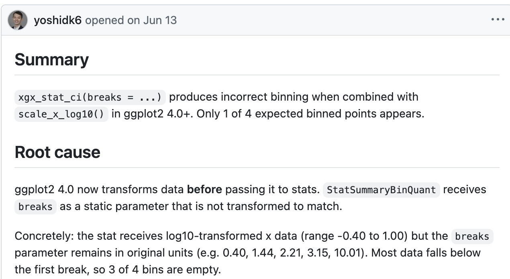
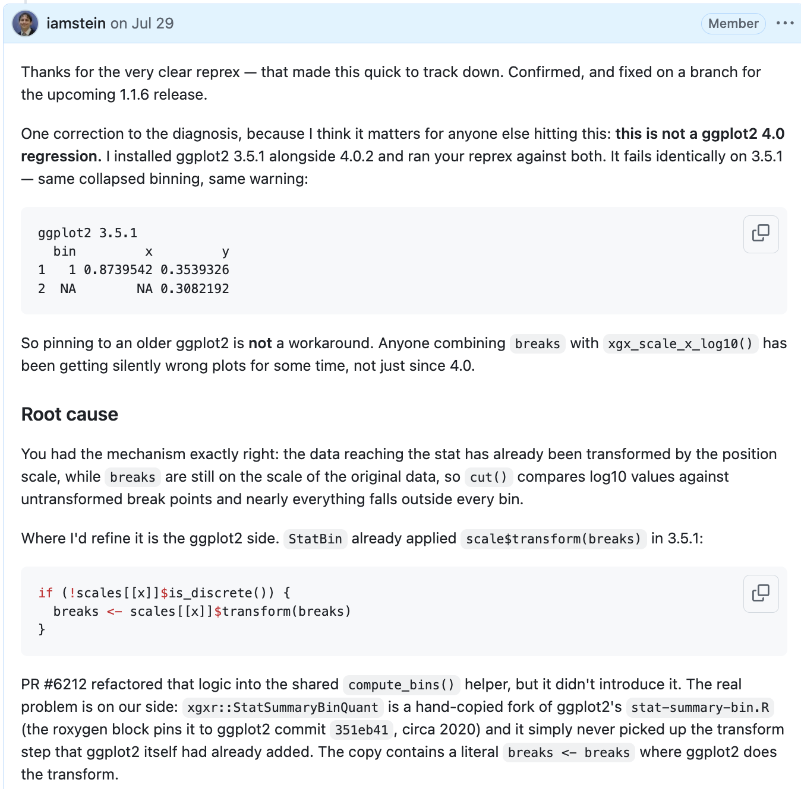

## Overview

* Four pieces of open-source work I did with Claude Code 
* Why I use Claude Code rather than Positron
* How I set up Claude Code.

# What it built

## 1. xgxr: what came in

{width="76%" fig-align="center" fig-alt="GitHub issue 72 reporting that xgx_stat_ci breaks produces incorrect binning with scale_x_log10 in ggplot2 4.0 and later."}

A good report: a reprex, and a diagnosis. Reported as a ggplot2 4.0 regression.

## 1. xgxr: what it actually was

The diagnosis was wrong in the way that mattered.

- ggplot2 3.5.1 was installed alongside 4.0.2 and the reprex run against both.
  It failed **identically** on 3.5.1.
- So not a 4.0 regression, and pinning an older ggplot2 was no workaround.
  Anyone combining `breaks` with `xgx_scale_x_log10()` had been getting
  silently wrong plots since about 2020.
- `xgxr::StatSummaryBinQuant` is a hand-copied fork of ggplot2's
  `stat-summary-bin.R`, pinned in its roxygen block to ggplot2 commit
  `351eb41`. It never picked up a transform step ggplot2 added later.

## 1. xgxr: the one line at the heart of it

Our copy read:

```r
breaks <- breaks
```

where ggplot2 had long since been doing:

```r
breaks <- scales[[x]]$transform(breaks)
```

Data reaching the stat is already log10-transformed and the breaks were not,
so `cut()` compared transformed data against untransformed break points and
dropped nearly everything.

::: {.notes}
Silently wrong plots is the part that lands with this room. Not a crash. A
plot that looked fine and was not.
:::

## 1. xgxr: and then the release

- Fix on a branch, then 1.1.6 to CRAN
- Along the way it noticed a hyperlink whose TLS certificate had expired, which
  is the kind of thing CRAN rejects a submission for, and removed it unasked
- `cran-comments.md` updated, win-builder run, the result recorded

Issue opened 13 June, fixed 28 July, merged 3 August, all through Claude Code.

::: {.notes}
The tedious half of a CRAN release is checks, comments and re-checks, and that
half is what got absorbed.
:::

## 2. xgx onto Continuous Integration

**Continuous Integration (CI) via GitHub Actions publishes the site.**

A server rebuilds the site from source on every push, so what is published is
a build product rather than something a person renders and commits by hand.

Before, the rendered HTML lived in the repository, and someone had to remember
to rebuild it and commit the result. Now `build-site.yml` renders on every
push and deploys from `master`, and the Pages source was switched from a
branch to GitHub Actions.

## 2. xgx: the HTML left the repository

| | Before | After |
|---|---|---|
| Tracked `.html` files | 38 | 3 |

The three that remain are site templates — `header.html`, `body.html`,
`icon_nav.html` — which are source, not output.

::: {.notes}
Be precise here: build output is gone, templates stay. Someone will check.
:::

## 2. xgx: and it cleaned the folder up while it was there

One commit, *Retire the vendored xgxr 1.0.2 material and other dead code*:

- **72 files deleted**, 77 touched
- **8,403 lines removed**, 70 added
- Including a vendored 1.8 MB `xgxr_1.0.2.tar.gz`

I am not a GitHub expert, and I set none of this up by hand.

::: {.notes}
Linger here. CI plumbing and a dead-code sweep are exactly the jobs that never
get done because nobody wants to spend a weekend on them.
:::

## 3. A new package: synpmx

**Structurally Faithful Synthetic Pharmacometric Data**

Generating realistic synthetic PK/PD datasets, so workflows, teaching material
and tooling can be developed and shared without exposing real clinical data.

Written from nothing to a working package with a pkgdown site.

## 4. A strategic question, not a coding task

**Does intra-patient dose escalation reach a confirmable active dose sooner in
a first-in-human T-cell engager trial?**

What came back was not code. It was a specification, a reading queue, and a
references page marking, for every source, whether the claim drawn from it had
actually been checked against the source.

::: {.notes}
This is the one that surprised me. Worth dwelling on.
:::

# How it is set up

## The pattern: it builds a website, and I read the website

- It works, commits, and pushes
- CI publishes the site
- I look at the rendered output — on my phone, at home, or at work
- No local environment, no screen sharing, no "can you paste the output"

**And it sets all of that up itself.** The Actions workflow, the publishing,
the theme.

::: {.notes}
This is the transferable idea. Everything else is detail.
:::

## Why Claude Code rather than Positron

1. **It runs longer with less input.** Fewer round trips per unit of work.
2. **It runs on my own machine at home, against ordinary GitHub.** No
   confusion with the GitHub Copilot setup and the `user5-2-1_NVTS` GitHub
   account.
3. **I can drive it from my phone, my home machine, or my work machine**
   with remote control.
4. **I can choose to use the latest model (Fable).** Though it kicked me back
   to Opus because I was working on "bio".

## Remote work is one line: `/remote-control`

One command from my home machine, and often not even that. A fresh session
checks the repository out and picks up where the last one stopped, because the
state lives in the repository rather than in the session.

::: {.notes}
Show the web interface here. Keep it short — the demo carries this.
:::

## Demo

*[live]*

## Getting access

Running Claude directly at `claude.ai` is blocked until you have done the
short internal training. When you hit the block, click the link it gives you
and do the training.

*[Maybe Alex can send me the link?]*

## If you want to try it

1. Do the training, so `claude.ai` is not blocked
2. Pick a repository with **no** sensitive data
3. Give it a small, checkable task — a failing test, a CI workflow
4. Have it publish a site, so you can read the output rather than run it
5. Write a `CLAUDE.md` for the repository once the conventions matter

## Questions

## Appendix: the full diagnosis {visibility="uncounted"}

{width="50%" fig-align="center" fig-alt="The reply on issue 72, correcting the diagnosis and tracing the cause to the hand-copied stat."}
