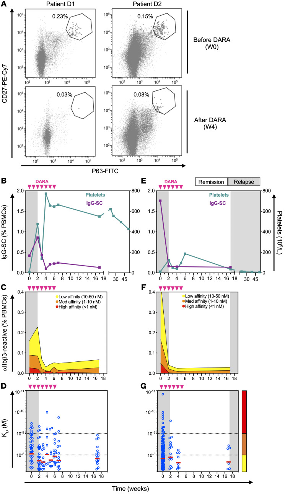
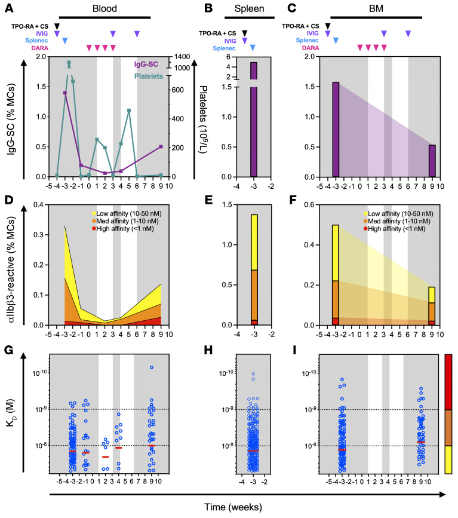

## Evidence Overview

**There is human ITP evidence linking B-cell biology to platelet outcomes,
but no validated conversion from total B-cell count to platelet count emerged
from this search.** The most informative observations distinguish ordinary
B cells from antiplatelet antibody-secreting cells, and circulating cells from
tissue reservoirs. Marked depletion can coexist with active disease, while
B-cell recovery can coexist with a platelet response. Relevant examples include
[splenic depletion after rituximab](https://pmc.ncbi.nlm.nih.gov/articles/PMC3204911/)
and [rituximab plus belimumab](https://pmc.ncbi.nlm.nih.gov/articles/PMC8409028/).

The working dose-selection objective remains durable platelet control with
acceptable immune recovery. Healthy naive-cell return can be compatible with a
reset, but a naive-dominant phenotype does not itself demonstrate restored
self-tolerance. The [Crickx relapse study](https://pmc.ncbi.nlm.nih.gov/articles/PMC7610758/)
provides an ITP-specific reason to retain that distinction.

This is a targeted literature assessment for the
[working specification](specification.qmd). It does not establish a clinical
biomarker cutoff or report a fitted PK–B-cell–platelet model. Each study below
separates the observed result from its proposed use. The
[platelet kinetics gallery](platelet-kinetics.qmd) supplies complementary
therapy-specific platelet curves.

| Measurement | What the literature supports | Implication for this project |
|---|---|---|
| Peripheral total CD19-positive B cells | A depletion/recovery readout; selected-cohort association with relapse [1] | Useful pharmacodynamic measurement; insufficient by itself to identify pathogenic activity |
| Naive, memory and regulatory subsets | Distinct roles and context-dependent associations [2–4] | Separate subsets; avoid a universal rule that all B-cell return is harmful |
| Platelet-specific antibody-secreting cells | Direct mechanistic evidence, including tissue persistence and small longitudinal studies [6–8] | A closer candidate link to disease activity, with limited availability and validation |
| Antiplatelet antibody assays | Associations with disease state and some treatment responses; conflicting prediction results [9–12] | Explore serial antigen-specific assays with explicit measurement error and assay definitions |
| Total immunoglobulin G (IgG) | Broad humoral readout rather than antigen-specific activity | Retain as immune-safety context; do not equate its decline with antiplatelet antibody elimination |
| Tissue B-cell or plasma-cell measurements | Spleen and marrow can retain pathogenic populations [5–8] | Record the tissue, cell identity and antigen specificity; a biopsy is not a whole-body burden measurement |

Study numbers refer to the entries below. The last column contains modelling
judgments, not validated decision rules.

## Peripheral B Cells and Platelet Outcomes

### 1. B-cell Recovery and Relapse After Rituximab

[Patel et al., *Blood*, 2012 — Outcomes 5 years after response to rituximab](https://pmc.ncbi.nlm.nih.gov/articles/PMC3383014/).
**Verification: full-text results and Figure 3 checked.**

**Observed:** Among 32 selected patients with an initial response lasting more
than a year, B-cell return was faster in those who subsequently relapsed than
in those with responses beyond 2.5 years. The groups contained 14 and 18
patients, respectively.

**Interpretation:** This is longitudinal clinical evidence for an association
between recovery and durability. It neither randomizes depletion duration nor
measures the pathogenic fraction of returning B cells. Selection of initial
responders limits application to the whole treated population. It cannot show
that increasing dose to prolong depletion improves the outcome. Figure 3 is
included in the [existing gallery](platelet-kinetics.qmd#view-rituximab-recovery);
its printed B-cell units need checking before extracting numbers.

### 2. Regulatory B-cell Function and Platelet Counts

[Li et al., *Blood*, 2012 — Defective regulatory B-cell compartment](https://pmc.ncbi.nlm.nih.gov/articles/PMC3476542/).
**Verification: full-text methods and results checked.**

**Observed:** Chronic ITP patients with low counts showed impaired B-cell
interleukin-10 (IL-10) responses and reduced suppression of monocyte activation.
In five nonsplenectomized patients measured before and after thrombopoietic
treatment, the CD19-positive/CD24-high/CD38-high subset increased as platelets
improved. Total B-cell proportions were less informative.

**Interpretation:** Some B-cell functions may restrain inflammation. The paired
observations cannot distinguish immune recovery causing platelet improvement
from treatment or platelet improvement changing the immune measurements.
A surface-defined “regulatory” population and demonstrated suppressive function
should be recorded separately.

### 3. A Different Subset Pattern in Untreated ITP

[Hayashi et al., *International Journal of Hematology*, 2021 — Regulatory and pre-germinal-center B cells](https://pubmed.ncbi.nlm.nih.gov/34309815/).
**Verification: primary-report abstract checked; full text not reviewed.**

**Observed:** Untreated patients had increased percentages of regulatory,
pre-germinal-center and plasmablast-like populations. Higher absolute counts
of the first two populations were associated with later need for second-line
therapy. B-cell activating factor (BAFF) and platelet-associated IgG correlated
with several subset counts.

**Interpretation:** The direction differs from a simple “more regulatory B cells
means better platelets” hypothesis. Cohort, treatment state, denominator and
functional definition may account for differences from Li et al. The abstract
alone does not establish an externally validated prediction rule.

### 4. B-cell Recovery During Response to Combination Therapy

[Mahévas et al., *Haematologica*, 2021 — RITUX-PLUS](https://pmc.ncbi.nlm.nih.gov/articles/PMC8409028/).
**Verification: full-text clinical, antibody and immunophenotyping results checked.**

**Observed:** This single-arm study treated 15 adults with rituximab plus
belimumab. Twelve responded at week 52; all but one had detectable peripheral
B cells. Naive/transitional recovery occurred while memory cells remained
suppressed. Comparison with 12 rituximab-only patients found broadly similar
repopulation kinetics. Of ten initially antibody-positive patients, two
responded despite persistent antibodies and one failed to respond despite
becoming antibody-negative.

**Interpretation:** Clinical response and total B-cell return can coexist.
Antibody negativity and response were also discordant in both directions.
The nonrandomized comparison cannot establish the added efficacy of belimumab,
and the study did not directly sample splenic plasma cells. Figures 1–3 and
supplementary Table S4 are useful for following the different measurements.

## Tissue B Cells and Autoreactive Plasma Cells

### 5. Splenic B-cell Depletion Can Occur Without Clinical Response

[Audia et al., *Blood*, 2011 — Immunologic effects of rituximab on the human spleen](https://pmc.ncbi.nlm.nih.gov/articles/PMC3204911/).
**Verification: full-text methods, results and discussion checked.**

**Observed:** Analysis of 18 ITP spleens included ten from rituximab-treated
patients. Substantial splenic B-cell depletion was present despite treatment
failure, and plasma cells remained detectable. Residual B cells also depended
on the interval between rituximab and splenectomy.

**Interpretation:** Even a tissue depletion measurement can miss the disease-driving
population if it aggregates cell types. These are spleens obtained at surgery,
with selection for difficult disease and differing treatment histories. They
cannot define a prospective depletion threshold for an expansion cohort.
The study did not establish the antigen specificity of the remaining cells;
that distinction is addressed more directly in the next study.

### 6. Antiplatelet Plasma Cells Persist After Rituximab

[Mahévas et al., *Journal of Clinical Investigation*, 2013 — B cell depletion reveals splenic long-lived plasma cells](https://pmc.ncbi.nlm.nih.gov/articles/PMC3533302/).
**Verification: full-text methods and results checked.**

**Observed:** Ten rituximab nonresponders underwent splenectomy three to six
months after treatment. Residual antibody-secreting cells included antiplatelet
plasma cells with a long-lived transcriptional program. Seven subsequently
had a complete response to splenectomy. Untreated ITP spleens provided a
comparison population.

**Interpretation:** This supports a plasma-cell reservoir that survives depletion
of conventional B cells. The proposed treatment-induced survival niche is a
mechanistic interpretation rather than proof from randomized tissue sampling.
A model that makes pathogenic antibody production proportional to total
circulating B cells would miss this failure mode. The seven surgical responses
do not isolate plasma-cell removal from the spleen's other functions.

### 7. Surviving Memory Cells and Newly Recruited Naive Cells in Relapse

[Crickx et al., *Science Translational Medicine*, 2021 — Rituximab-resistant splenic memory B cells and newly engaged naive B cells fuel relapses](https://pmc.ncbi.nlm.nih.gov/articles/PMC7610758/).
**Verification: full-text phenotyping and repertoire results checked.**

**Observed:** Relapse spleens contained active germinal centers, where B cells
undergo selection and differentiation. Phenotyping, antibody-gene sequencing
and antigen-specific assays implicated both surviving mutated memory cells and
newly generated cells. The initial phenotyping comparison included eight relapse
spleens; deeper analyses used smaller subsets. Resistant memory cells retained
CD19 expression.

**Interpretation:** This study concerns reactivation after an initial response,
which differs from primary nonresponse with persistent plasma cells. A
naive-dominant recovering compartment can still participate in autoreactivity.
The desirable endpoint is recovery with sustained tolerance to platelet antigens.
The study does not establish how often naive recovery leads to relapse, and
CD19 expression alone does not establish clinical superiority of CD19 targeting.

### 8. Autoreactive Cells Across Spleen, Blood and Bone Marrow

[Canales-Herrerias et al., *Journal of Clinical Investigation*, 2022 — High-affinity autoreactive plasma cells disseminate through multiple organs](https://pmc.ncbi.nlm.nih.gov/articles/PMC9197514/).
**Verification: full-text results and Figures 4–5 checked.**

**Observed:** Single-cell analysis in 27 patients measured secretion and binding
to the platelet antigen αIIbβ3 (GPIIb/IIIa). Autoreactive cells occurred in
multiple compartments. Three daratumumab-treated patients supplied longitudinal
observations with different outcomes, including marrow persistence after failure.

**Interpretation:** This is a particularly relevant dataset for a mechanistic
link, but three heterogeneous treatment histories cannot identify a general
dose-response function. Dexamethasone accompanied infusions; other treatments
also complicate attribution. The assay covered one antigen and IgG, and some
samples contained few autoreactive cells.

{#fig-dara-blood width=100%}

[Original Figure 4 and legend](https://pmc.ncbi.nlm.nih.gov/articles/PMC9197514/figure/F4/).
Platelets use the right axes in B/E. Cellular measurements do not span all late
platelet follow-up; observe the time-axis breaks.

{#fig-dara-tissue width=100%}

[Original Figure 5 and legend](https://pmc.ncbi.nlm.nih.gov/articles/PMC9197514/figure/F5/).
Sparse tissue samples are joined graphically. These joins do not demonstrate
continuous tissue trajectories. Lower dissociation constant, K_D, denotes higher
affinity.

Both images: Canales-Herrerias et al., 2022,
[CC BY 4.0](https://creativecommons.org/licenses/by/4.0/), unchanged source JPEGs.

## Antiplatelet Antibodies and Platelet Outcomes

### 9. Bone Marrow and Blood Antibody Results Can Disagree

[Shrestha et al., *Blood Advances*, 2020 — Platelet autoantibodies in the bone marrow](https://pmc.ncbi.nlm.nih.gov/articles/PMC7362381/).
**Verification: full-text methods and results checked.**

**Observed:** In 18 ITP patients, ten had detectable marrow autoantibodies;
five of those lacked detectable peripheral-blood autoantibodies. The study
measured free and cell-bound glycoprotein-specific antibodies in marrow
aspirates and blood.

**Interpretation:** A negative peripheral assay can miss compartmentalized
activity. This is antibody detection in an aspirate, not direct measurement of
marrow B-cell burden or antibody production rate. The mixed-cell preparation
cannot fully localize cell-bound signal. The study is small and cross-sectional,
so it supplies neither a marrow depletion target nor a longitudinal platelet
prediction rule.

### 10. Antibody Positivity and Decline Associated With Rituximab Response

[Porcelijn et al., *Blood*, 2017 — Lack of detectable platelet autoantibodies and nonresponsiveness](https://pure.eur.nl/ws/files/47806050/RePub-108517-OA.pdf).
**Verification: full report read through the institutional repository.**

**Observed:** Among 99 patients with sufficient platelets for baseline testing,
43/79 antibody-positive patients responded versus 4/20 antibody-negative patients.
Serially tested complete responders showed antibody decline. The main assay was
platelet immunofluorescence, including an eluate assay; glycoprotein-specific
confirmation was possible in a smaller subset.

**Interpretation:** The longitudinal comparison selected each patient's highest
platelet count within ten weeks and grouped patients by response. It therefore
assesses association with an outcome-selected timepoint, not whether an early
antibody change predicts later response. Assay availability also depended on
platelet yield. Figure 1 is useful, but should not be treated as an unbiased
antibody-versus-platelet exposure-response curve.

### 11. A Trial-based Antibody Analysis Did Not Confirm Simple Prediction

[Arnold et al., *British Journal of Haematology*, 2017 — Effect of rituximab on antiplatelet autoantibody levels](https://pubmed.ncbi.nlm.nih.gov/28444742/).
**Verification: primary-report abstract checked; publisher full text inaccessible.**

**Observed:** In a nested case-control analysis of a randomized trial, 55 patients
were evaluable. Rituximab reduced anti-GPIIb/IIIa levels relative to placebo,
with no significant reduction in anti-GPIb/IX. Neither baseline antibody
presence nor antibody loss was associated with rituximab response. A subset
with persistent antibodies failed to respond.

**Interpretation:** Pharmacodynamic antibody reduction need not establish
clinical surrogacy. This conflicts with a universal prediction rule based on
Porcelijn et al. Differences in assays and analysis deserve examination in the
full text before pooling results. The persistent-antibody subgroup observation
should not override the report's overall negative prediction result.

### 12. Serial Antibody Testing and Clinical Remission

[Al-Samkari et al., *Blood Advances*, 2020 — Modern reassessment of glycoprotein-specific direct platelet autoantibody testing](https://pmc.ncbi.nlm.nih.gov/articles/PMC6960466/).
**Verification: full-text assay methods and longitudinal results checked.**

**Observed:** Sixty-four patients had repeated testing. All ten who went from
active disease to clinical remission converted from positive to negative.
Other patients acquired additional antibody specificities, termed epitope
spreading. Some remission samples remained antibody-positive. Here remission
required platelets ≥100 × 10^9^/L off ITP therapy for at least 12 months.

**Interpretation:** This supports serial serology as a disease-state measurement.
It does not establish that seroconversion precedes remission or predicts its
durability. Testing intervals varied, very low platelet counts sometimes
prevented testing, and the study's optimized direct assay results should not
be transferred to generic antibody tests. Figure 4 depicts serologic evolution,
not a continuous antibody-titer/platelet trajectory.

### 13. Antibodies Can Impair Platelet Production

[Iraqi et al., *Haematologica*, 2015 — Antiplatelet autoantibodies inhibit proplatelet formation](https://pmc.ncbi.nlm.nih.gov/articles/PMC4420211/).
**Verification: full-text experimental methods and results checked.**

**Observed:** Serum/IgG from 19 patients was tested in cultured human
megakaryocytes, the cells that produce platelets. Thirteen samples reduced
proplatelet formation, accompanied by reduced platelet release. Romiplostim
and eltrombopag restored proplatelet formation in the experimental system.

**Interpretation:** The antibody-to-platelet link can operate through production
as well as destruction. This is an in-vitro experiment using differentiating
cord-blood-derived cells; its concentrations and effects are not directly
calibrated to an individual patient's platelet turnover.

### 14. Antibody Specificity Does Not Fully Specify Its Functional Effect

[Zheng et al., *Haematologica*, 2022 — Antiplatelet antibody predicts platelet desialylation and apoptosis](https://pmc.ncbi.nlm.nih.gov/articles/PMC9425302/).
**Verification: full-text experimental results checked.**

**Observed:** Sera from 61 ITP patients were tested on donor platelets.
Antibody-positive samples induced desialylation, the removal of surface sialic
acids, and apoptosis-related changes. Anti-GPIIb/IIIa and anti-GPIb/IX showed
differing functional patterns; anti-GPIIb/IIIa effects included desialylation.

**Interpretation:** An antigen label or binding titer is an incomplete measure
of pathogenic potency. These results argue against assigning each antigen a
single exclusive clearance mechanism. Donor-platelet assays and supporting
mouse experiments need clinical calibration before becoming a quantitative
link in a patient model.

### 15. Splenic T-cell Help Supports B-cell Differentiation

[Audia et al., *Blood*, 2014 — Splenic TFH expansion and antiplatelet-antibody production](https://www.sciencedirect.com/science/article/pii/S0006497120396890).
**Verification: primary-report methods and results available through publisher text checked.**

**Observed:** Splenic T follicular helper (TFH) cells were expanded in ITP.
The experiments implicated IL-21 and CD40/CD40L signalling in B-cell
differentiation and antiplatelet antibody production.

**Interpretation:** The cellular environment can alter the output of a given
number of B cells. The authors did not directly test TFH–B-cell coculture,
and the direction of the clinical association with inflammation remained
uncertain. TFH measurements are mechanistic candidates, not an established
additional predictor for a small ITP expansion.

## Measurement Definitions

| Quantity | Measurement needed | Interpretation issue |
|---|---|---|
| Peripheral B-cell depletion | Absolute count, assay sensitivity and time after dose | All doses below quantification can conceal differences in residual cells; a recorded zero is not demonstrated absence |
| Immunophenotype | Absolute subset counts plus percentages, with a consistent gating definition | A higher subset percentage can result from depletion of other subsets |
| Plasma cells/plasmablasts | A panel appropriate to the drug target, including cells that a conventional B-cell gate may miss | A routine CD19-positive B-cell count cannot be assumed to include all antibody-secreting populations |
| Antigen-specific antibody-secreting cells | Functional secretion assay, such as ELISpot or single-cell secretion analysis | Antigen specificity, secretion rate and affinity add information beyond total plasma-cell number |
| Direct glycoprotein-specific antibody | Antibody bound to the patient's platelets | Platelet yield and recent treatments affect interpretability; assay failure is not seronegativity |
| Indirect antibody | Free antibody tested from plasma/serum | Binding, distribution and assay sensitivity can produce disagreement with a direct assay |
| Platelet-associated IgG | Total platelet-associated immunoglobulin signal | Does not identify a particular platelet antigen; not interchangeable with a glycoprotein-specific assay |
| Tissue measurement | Named organ, cell identity, density/denominator, sampling time and tissue quality | One site or aspirate samples a compartment; percentage depletion does not directly measure remaining pathogenic burden |

The assay distinctions follow the primary studies above, particularly
[Al-Samkari](https://pmc.ncbi.nlm.nih.gov/articles/PMC6960466/) and
[Shrestha](https://pmc.ncbi.nlm.nih.gov/articles/PMC7362381/). The proposed handling
of limits of quantification, denominators and target interference is an
analysis recommendation. Under a B-cell-directed drug, confirm that treatment
has not masked the epitope used to detect the cells.

## Implications for PK–B-cell–Platelet Modelling

The literature supports testing a model with distinct immune and platelet
processes. It does not require estimating every intermediate process. The
following diagram is a proposed structure; arrows indicate candidate biological
links, not effect sizes established by the cited studies.

```{mermaid}
flowchart TD
  PK[Drug exposure] --> B[Susceptible blood and tissue B cells]
  B --> ASC[Pathogenic antibody-secreting cells]
  T[T-cell help and tissue survival signals] --> ASC
  RES[Persistent or renewed autoreactive reservoirs] --> ASC
  ASC --> A[Antiplatelet antibody activity]
  A --> CLEAR[Platelet clearance]
  A --> PROD[Platelet production]
  ALT[Other immune mechanisms] --> CLEAR
  TPO[TPO-RA and other concomitant therapy] --> PROD
  CLEAR --> P[Platelet count]
  PROD --> P
  PK -. target-dependent effect .-> ASC
  B --> REC[Naive and memory recovery measured separately]
```

### Candidate Model and Comparisons

Start with a small number of prespecified immune summaries and compare their
incremental prediction of later platelet outcomes against dose/PK and observed
platelet history alone. Candidates include depth of depletion, time to recovery
of defined subsets, and change in an antigen-specific antibody measurement.
Use a landmark before the outcome window so that a biomarker measured at a
patient's best platelet response does not become a predictor of that same
response. Retain rescue treatment, concomitant doses and observation timing.

A mechanistic extension becomes more informative when repeated measurements
resolve the order of changes: exposure, depletion, antibody activity and platelet
response. A latent pathogenic-cell compartment may accommodate tissue persistence,
but its parameters need external constraints or informative measurements.
Peripheral total B cells and platelets alone are unlikely to identify separate
tissue depletion, plasma-cell survival, antibody clearance and platelet turnover
rates. That is an identifiability judgment, not a reported fit from these papers.

### Conditions That Reduce Its Value

- Every dose produces indistinguishable peripheral depletion, and no additional
  assay resolves tissue or pathogenic-cell differences.
- Antibody testing is mostly negative or unquantifiable, or fails preferentially
  when platelet counts are lowest.
- Follow-up ends before immune recovery, leaving suppression and durable reset
  observationally indistinguishable.
- Rescue and TPO-RA changes dominate the platelet course without adequate dose
  histories or informative timing.
- The immune-to-platelet relationship changes across patients, and the small
  expansion cannot distinguish that heterogeneity from noise.

### Borrowing From Other Indications

For six ITP patients per dose and larger same-agent cohorts elsewhere, use other
indications to inform shared PK and selected drug-to-B-cell parameters only to
the extent that the assays, target biology, exposures and compartments are
comparable. Estimate or challenge indication differences rather than assuming
complete exchangeability. Carry uncertainty from the shared component into ITP
predictions.

The immune-to-platelet link still needs ITP information. A salivary-gland biopsy
in another indication might demonstrate tissue pharmacology but cannot establish
clearance of an ITP marrow or splenic reservoir. Neither a common depletion
threshold nor a shared naive-cell phenotype transfers clinical efficacy by
itself. Larger non-ITP cohorts can narrow the pharmacologically plausible dose
range while leaving the ITP efficacy ranking uncertain.

With such a small ITP expansion, a dose shortlist supported by pharmacology may
be a defensible output even when an integrated platelet prediction is not.
Compare decisions from PK alone, PK plus immune measurements, and any integrated
model under scenarios with and without durable reset, persistent plasma cells
and failure of cross-indication borrowing.

## Measurements to Prioritize

These are proposed research priorities for the current project, not a clinical
sampling standard.

1. Collect aligned platelet counts, PK, absolute B-cell/subset counts, and full
   rescue/concomitant-treatment histories. Include follow-up during recovery.
2. Bank paired samples for a centralized glycoprotein-specific antibody assay;
   establish feasibility at low platelet counts before relying on the endpoint.
3. Add plasma-cell/plasmablast measurements that fit the investigational drug's
   target. Where feasible, measure antigen-specific secretion rather than only
   surface phenotype.
4. Use tissue already available from clinically indicated procedures or an
   appropriately designed substudy. Specify which pathogenic population the
   specimen can measure and what an undetectable result would mean.
5. Retain total IgG and clinical infection information for the benefit–risk
   assessment. Neither substitutes for antigen-specific efficacy biology.

A candidate reset would be supported by sustained platelet control after
relevant drug activity has waned and rescue/supporting therapy has ended,
with immune recovery and no evidence of renewed pathogenic activity. It remains
an operational hypothesis: absence in a sampled compartment does not establish
eradication everywhere. Longer depletion adds value only if it improves durable
control enough to justify its immune consequences; it is not itself the goal.

## Reading Order and Access Gaps

Start with [Canales-Herrerias 2022](https://pmc.ncbi.nlm.nih.gov/articles/PMC9197514/)
for the paired cellular/platelet observations and tissue compartments, then
[Crickx 2021](https://pmc.ncbi.nlm.nih.gov/articles/PMC7610758/) for the relapse/reset
question. Read [Mahévas 2013](https://pmc.ncbi.nlm.nih.gov/articles/PMC3533302/)
for primary nonresponse. Compare the two 2017 antibody studies before choosing
an antibody endpoint, then use RITUX-PLUS and Al-Samkari for longitudinal
sampling and discordance examples.

The full texts of **Arnold 2017** and **Hayashi 2021** would improve this review;
their entries currently rely on abstracts. The Arnold publisher page returned
403. Useful additions are their assay definitions, individual longitudinal
plots and supplementary analyses. The other entries' verification labels refer
to the portions used here, not a complete audit of every result or supplement.

Searches were run on 14 September 2026 using combinations of ITP/immune
thrombocytopenia with B-cell depletion/repopulation, subsets, rituximab relapse,
antiplatelet antibodies, plasma cells, spleen, bone marrow and longitudinal
platelet outcomes. Reference chains were followed to primary reports. This was
not a systematic review. Absence of a validated quantitative link in this
search is not proof that no such work exists. The 2022 Canales-Herrerias paper
is the published counterpart of the 2021 dissemination preprint previously
listed in the project's reference notebook.
