Published figures show platelet-count trajectories in immune thrombocytopenia
(ITP), from the first days after treatment to years of follow-up. The collection
contains 20 source images: 14 with longitudinal platelet counts, four with
response-duration information, one with B-cell recovery and one with dose
history. Cross-trial efficacy ranking and quantitative curve fitting are outside
this collection's scope.

Each entry identifies the population and the plotted quantity. Time axes,
summary statistics, rescue exclusions and the patients contributing late
observations differ across figures. A mean or median curve can hide individual
fluctuations; response-survival curves describe how long a response lasts.
Study regimens below identify the evidence being shown.

For the dose-selection question in the [working specification](specification.qmd),
look for counts maintained after treatment withdrawal and during immune recovery.
The working hypothesis allows healthy naive B cells to return after a reset.
Total peripheral B-cell depletion duration alone cannot establish that reset;
these figures do not validate an immunophenotype as a surrogate for durable ITP
control.

## Figure Index

| Modality | Figures | Main view |
|---|---|---|
| [B-cell depletion](#b-cell-depletion) | Rituximab | Long-term counts, response persistence, B-cell recovery |
| [TPO pathway](#tpo-pathway) | Romiplostim, avatrombopag, eltrombopag, recombinant TPO | Counts during treatment and dose adjustment |
| [Rapid immunomodulation](#rapid-immunomodulation) | Intravenous immunoglobulin and anti-D | Early counts and repeated individual treatment episodes |
| [Corticosteroids](#corticosteroids) | Dexamethasone followed by prednisone | Response persistence; early count kinetics still missing |
| [FcRn inhibition](#fcrn-inhibition) | Efgartigimod, rozanolixizumab | Counts with IgG changes or repeated dosing |
| [Signalling inhibitors](#signalling-inhibitors) | Rilzabrutinib, fostamatinib | Overall and responder-conditioned counts |
| [Plasma-cell targeting](#plasma-cell-targeting) | CM313 anti-CD38 | Early counts and individual response categories |
| [Splenectomy](#splenectomy) | Adult and pediatric cohorts | Early peaks and longer individual courses |

## B-cell Depletion {#b-cell-depletion}

### Rituximab: platelet counts after a four-dose course {#view-rituximab-count}

**Count trajectory.** Adults with chronic/refractory ITP; 18 treated with 375 mg/m² weekly for four doses.

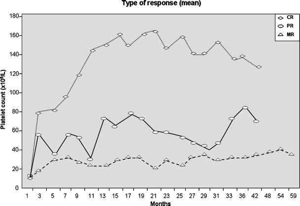{#fig-rituximab-count width=100%}

Curves are grouped by response category, not randomized dose. The image labels them
means, whereas the article text calls them medians. The month labels are unequally
spaced in time but equally spaced on the plot; do not estimate slopes from visual
distance.

Source: Jaime Garcia-Chavez et al. (2007), [Rituximab therapy for chonic and refractory immune thrombocytopenic purpura: a long-term follow-up analysis](https://pmc.ncbi.nlm.nih.gov/articles/PMC2040174/), [Figure 1 and original legend](https://pmc.ncbi.nlm.nih.gov/articles/PMC2040174/figure/Fig1/).

[Open image at full size](platelet-kinetics-images/rituximab-count.jpg).

Reuse status: Publisher copyright; no explicit open reuse licence identified on the retrieved article.

### Rituximab: years of response after treatment {#view-rituximab-duration}

**Response-duration context.** Selected initial responders; adult inclusion required response lasting at least one
year.

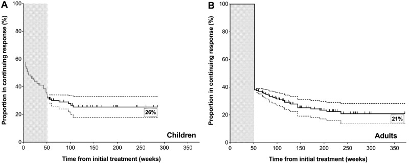{#fig-rituximab-duration width=100%}

These response-survival projections incorporate published first-year response estimates,
followed by the selected cohort’s longer follow-up. They are not platelet counts or a
single all-treated cohort. Adult and pediatric selection differs.

Source: Vivek L Patel et al. (2012), [Outcomes 5 years after response to rituximab therapy in children and adults with immune thrombocytopenia](https://pmc.ncbi.nlm.nih.gov/articles/PMC3383014/), [Figure 2 and original legend](https://pmc.ncbi.nlm.nih.gov/articles/PMC3383014/figure/F2/).

[Open image at full size](platelet-kinetics-images/rituximab-duration.jpg).

Reuse status: Publisher copyright; no explicit open reuse licence identified on the retrieved article.

### Rituximab: B-cell recovery alongside the durability question {#view-rituximab-recovery}

**Immune-recovery context.** B-cell trajectories in a selected subset of initial ITP responders.

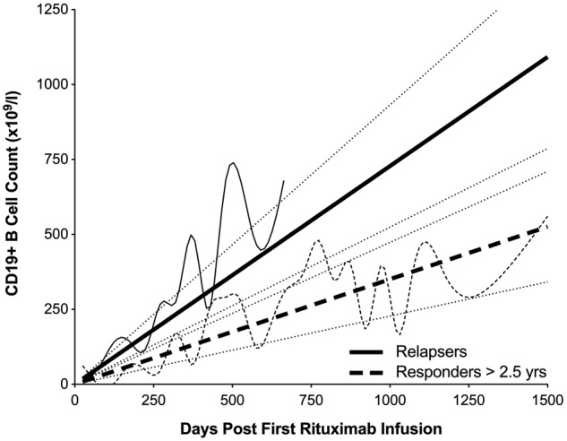{#fig-rituximab-recovery width=100%}

B-cell recovery in selected initial responders accompanies the durability analysis. The
plotted count scale and printed unit need reconciliation before digitization. The
association does not establish a dose effect or distinguish naive-cell recovery from
pathogenic-cell return.

Source: Vivek L Patel et al. (2012), [Outcomes 5 years after response to rituximab therapy in children and adults with immune thrombocytopenia](https://pmc.ncbi.nlm.nih.gov/articles/PMC3383014/), [Figure 3 and original legend](https://pmc.ncbi.nlm.nih.gov/articles/PMC3383014/figure/F3/).

[Open image at full size](platelet-kinetics-images/rituximab-recovery.jpg).

Reuse status: Publisher copyright; no explicit open reuse licence identified on the retrieved article.

## TPO Pathway {#tpo-pathway}

Thrombopoietin receptor agonists (TPO-RAs) include romiplostim, avatrombopag and
eltrombopag. The active-comparator study also includes recombinant human thrombopoietin
(rhTPO).

### Romiplostim: platelet counts through 24 weeks {#view-romiplostim-count}

**Count trajectory.** Routine-practice adult cohort, separated by disease duration at treatment initiation.

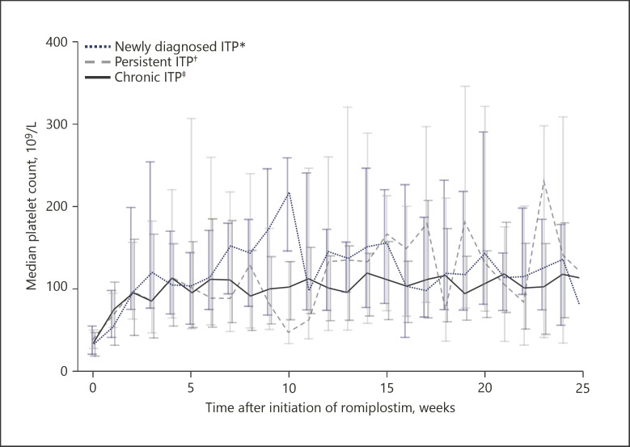{#fig-romiplostim-count width=100%}

Unweighted medians show longitudinal counts; interpret the medians alongside follow-up
availability and dose titration. Disease-phase groups are not randomized regimens.

Source: Marcel Reiser et al. (2021), [Romiplostim for Primary Immune Thrombocytopenia in Routine Clinical Practice: Results from a Multicentre Observational Study in Germany](https://pmc.ncbi.nlm.nih.gov/articles/PMC9393823/), [Figure 4 and original legend](https://pmc.ncbi.nlm.nih.gov/articles/PMC9393823/figure/F4/).

[Open image at full size](platelet-kinetics-images/romiplostim-count.jpg).

Reuse status: Reuse licence not resolved from the retrieved article; consult source copyright notice.

### Romiplostim: the dosing trajectory behind those counts {#view-romiplostim-dose}

**Dose context.** Same routine-practice cohort as the platelet plot above.

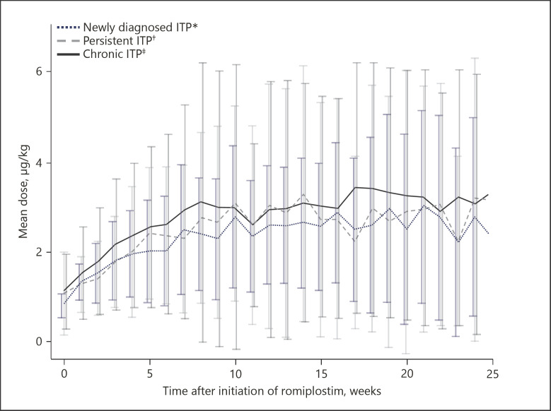{#fig-romiplostim-dose width=100%}

Mean weekly dose helps interpret the apparent count plateau. Response-guided dosing
means exposure is partly a consequence of earlier counts.

Source: Marcel Reiser et al. (2021), [Romiplostim for Primary Immune Thrombocytopenia in Routine Clinical Practice: Results from a Multicentre Observational Study in Germany](https://pmc.ncbi.nlm.nih.gov/articles/PMC9393823/), [Figure 3 and original legend](https://pmc.ncbi.nlm.nih.gov/articles/PMC9393823/figure/F3/).

[Open image at full size](platelet-kinetics-images/romiplostim-dose.jpg).

Reuse status: Reuse licence not resolved from the retrieved article; consult source copyright notice.

### Avatrombopag: early rise, core study and extension {#view-avatrombopag-count}

**Count trajectory.** Randomized adult chronic-ITP study, starting at 20 mg/day; core study and open-label
extension.

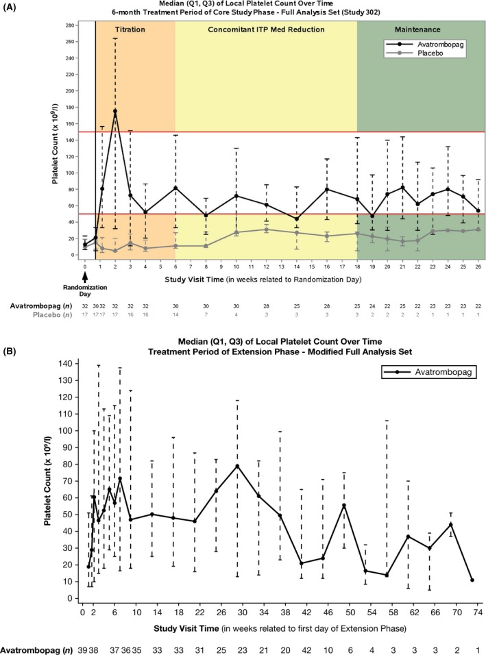{#fig-avatrombopag-count width=100%}

Medians and quartiles retain spread. Read the numbers observed and the change to the
extension population; later values do not represent an unchanged randomized cohort.

Source: Wojciech Jurczak et al. (2018), [Phase 3 randomised study of avatrombopag, a novel thrombopoietin receptor agonist for the treatment of chronic immune thrombocytopenia](https://pmc.ncbi.nlm.nih.gov/articles/PMC6282556/), [Figure 3 and original legend](https://pmc.ncbi.nlm.nih.gov/articles/PMC6282556/figure/bjh15573-fig-0003/).

[Open image at full size](platelet-kinetics-images/avatrombopag-count.jpg).

Reuse status: [CC BY-NC 4.0](https://creativecommons.org/licenses/by-nc/4.0/)

### Eltrombopag versus dose-optimized recombinant TPO {#view-eltrombopag-rhtpo-count}

**Count trajectory.** TE-ITP randomized active-comparator study in adults.

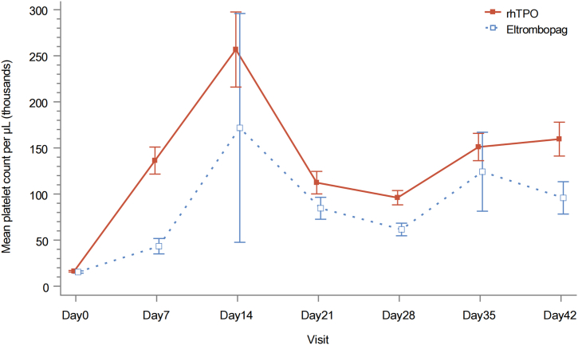{#fig-eltrombopag-rhtpo-count width=100%}

Mean counts with standard errors show a direct within-study comparison. The
interventions are treatment strategies with dose management, not equivalent fixed doses.

Source: Yunfei Chen et al. (2025), [Dose-optimised recombinant human thrombopoietin versus eltrombopag in patients with immune thrombocytopenia: a multicenter, randomised controlled trial (The TE-ITP Study)](https://pmc.ncbi.nlm.nih.gov/articles/PMC12396493/), [Figure 3 and original legend](https://pmc.ncbi.nlm.nih.gov/articles/PMC12396493/figure/fig3/).

[Open image at full size](platelet-kinetics-images/eltrombopag-rhtpo-count.jpg).

Reuse status: [CC BY 4.0](https://creativecommons.org/licenses/by/4.0/)

### Rituximab, TPO-RAs and oral immunosuppressants in children {#view-pediatric-comparison}

**Count trajectory at discrete visits.** ICON1 prospective observational study of children starting second-line therapy.

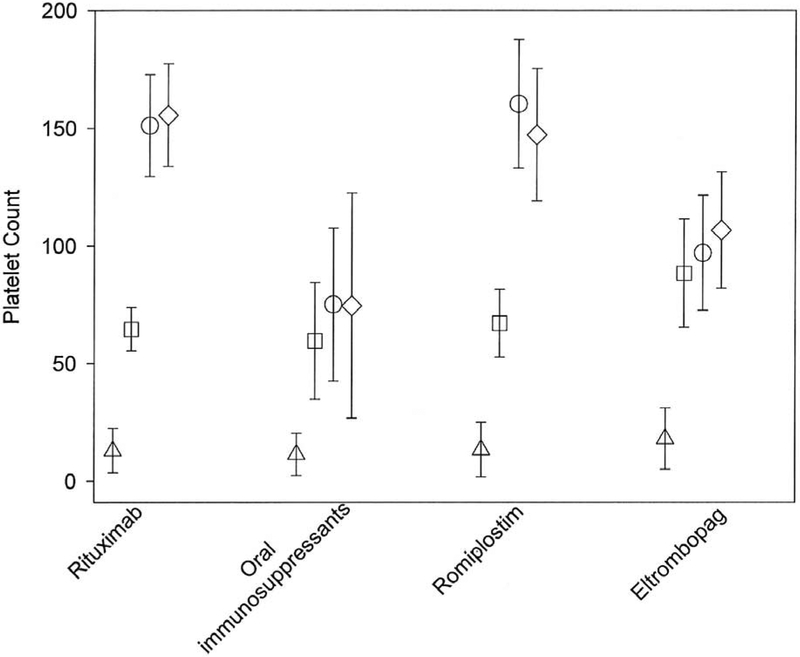{#fig-pediatric-comparison width=100%}

This source image is panel A alone. Medians are shown at baseline (triangles), 1 month
(squares), 6 months (circles), and 12 months (diamonds). Treatment assignment was not
randomized; pediatric results should not be substituted for adult ITP.

Source: Rachael F Grace et al. (2019), [Second-Line Treatments in Children with Immune Thrombocytopenia: Effect on Platelet Count and Patient-Centered Outcomes](https://pmc.ncbi.nlm.nih.gov/articles/PMC6527349/), [Figure 1A and original legend](https://pmc.ncbi.nlm.nih.gov/articles/PMC6527349/figure/F1/).

[Open image at full size](platelet-kinetics-images/pediatric-comparison.jpg).

Reuse status: Author manuscript; no explicit open reuse licence identified on the retrieved article.

## Rapid Immunomodulation {#rapid-immunomodulation}

Intravenous immunoglobulin (IVIg) and anti-D immunoglobulin figures resolve early
treatment episodes. The production marker shown below is the absolute immature platelet
fraction (A-IPF), expressed as a count of immature platelets.

### IVIg: early rise and subsequent decline {#view-ivig-count}

**Count trajectory.** Panzyga chronic-ITP study; full analysis set of 36 patients.

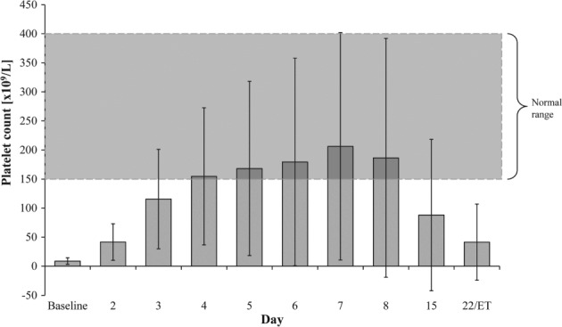{#fig-ivig-count width=100%}

A short-timescale platelet course useful for recognizing a rescue-treatment
contribution. ET denotes early termination, not a common scheduled late timepoint.

Source: O Arbach et al. (2019), [Efficacy and safety of a new intravenous immunoglobulin (Panzyga®) in chronic immune thrombocytopenia](https://pmc.ncbi.nlm.nih.gov/articles/PMC6850321/), [Figure 1 and original legend](https://pmc.ncbi.nlm.nih.gov/articles/PMC6850321/figure/tme12573-fig-0001/).

[Open image at full size](platelet-kinetics-images/ivig-count.jpg).

Reuse status: [CC BY 4.0](https://creativecommons.org/licenses/by/4.0/)

### IVIg and anti-D: repeated individual treatment episodes {#view-ivig-antid-individual}

**Individual count trajectory with production marker.** Selected patients with repeated anti-D or IVIg treatment episodes.

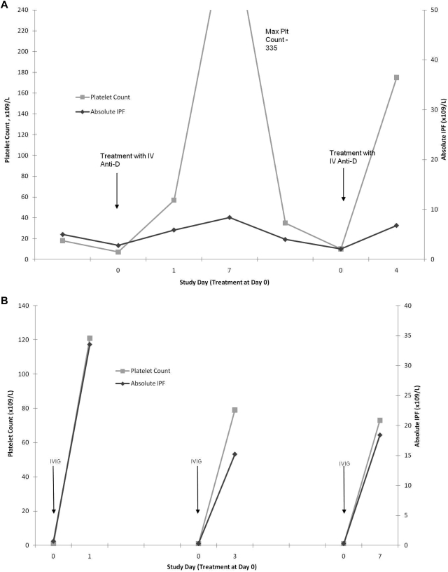{#fig-ivig-antid-individual width=100%}

Platelets and absolute immature platelet counts are shown together. Within-patient
recurrence is informative, but selected examples are not a population response
distribution.

Source: Sarah J Barsam et al. (2011), [Platelet production and platelet destruction: assessing mechanisms of treatment effect in immune thrombocytopenia](https://pmc.ncbi.nlm.nih.gov/articles/PMC3110029/), [Figure 4 and original legend](https://pmc.ncbi.nlm.nih.gov/articles/PMC3110029/figure/F4/).

[Open image at full size](platelet-kinetics-images/ivig-antid-individual.jpg).

Reuse status: Publisher copyright; no explicit open reuse licence identified on the retrieved article.

## Corticosteroids {#corticosteroids}

### Dexamethasone followed by prednisone: persistence of response {#view-steroid-persistence}

**Response-duration context.** Newly diagnosed adults treated with high-dose dexamethasone followed by prednisone
maintenance.

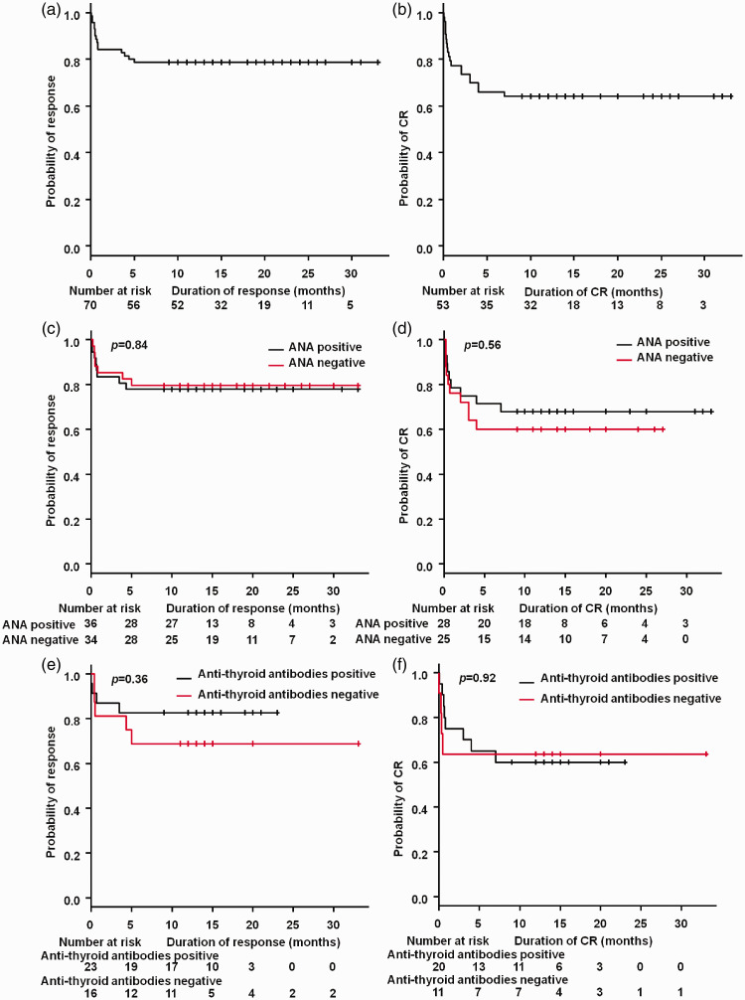{#fig-steroid-persistence width=100%}

Response-survival curves among initial responders, not raw platelet trajectories. This
combination cannot isolate a four-day dexamethasone effect; an early platelet-count
figure remains a requested addition.

Source: Jin Xu et al. (2021), [Clinical efficacy of high-dose dexamethasone with sequential prednisone maintenance therapy for newly diagnosed adult immune thrombocytopenia in a real-world setting](https://pmc.ncbi.nlm.nih.gov/articles/PMC8044565/), [Figure 2 and original legend](https://pmc.ncbi.nlm.nih.gov/articles/PMC8044565/figure/fig2-03000605211007322/).

[Open image at full size](platelet-kinetics-images/steroid-persistence.jpg).

Reuse status: [CC BY-NC 4.0](https://creativecommons.org/licenses/by-nc/4.0/)

## FcRn Inhibition {#fcrn-inhibition}

FcRn is the neonatal Fc receptor. The efgartigimod figure places platelet counts
alongside immunoglobulin G (IgG), providing a view of the pharmacodynamic marker and
clinical measurement on the same timeline.

### Efgartigimod: platelets and IgG on the same timeline {#view-efgartigimod-count-igg}

**Count trajectory with IgG and bleeding.** Randomized Phase 2 ITP study comparing placebo and 5 or 10 mg/kg, with four weekly
infusions.

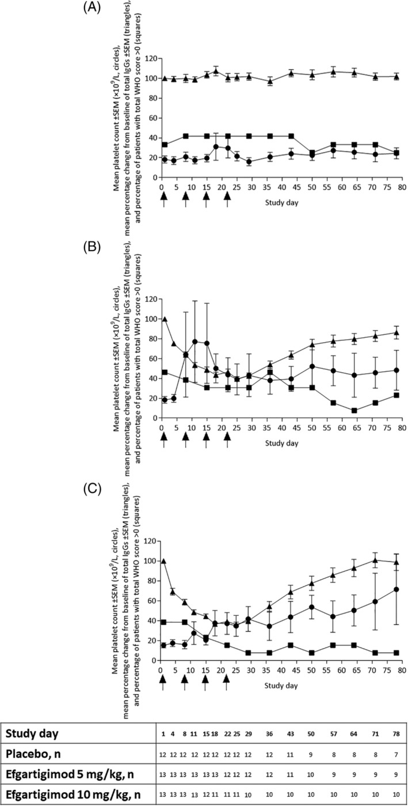{#fig-efgartigimod-count-igg width=100%}

Circles show mean platelets and triangles the IgG readout; arrows mark infusions. The
caption calls IgG a percentage change, but the plotted baseline is near 100; check that
convention before extracting values. Post-rescue observations are excluded.

Source: Adrian C Newland et al. (2019), [Phase 2 study of efgartigimod, a novel FcRn antagonist, in adult patients with primary immune thrombocytopenia](https://pmc.ncbi.nlm.nih.gov/articles/PMC7004056/), [Figure 2 and original legend](https://pmc.ncbi.nlm.nih.gov/articles/PMC7004056/figure/ajh25680-fig-0002/).

[Open image at full size](platelet-kinetics-images/efgartigimod-count-igg.jpg).

Reuse status: [CC BY-NC-ND 4.0](https://creativecommons.org/licenses/by-nc-nd/4.0/)

### Rozanolixizumab: placebo-controlled periods and extension {#view-rozanolixizumab-count}

**Count trajectory.** Two randomized ITP studies and their open-label extension.

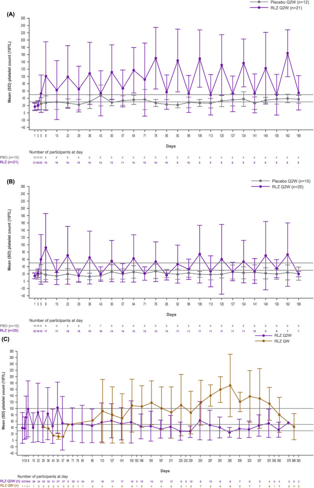{#fig-rozanolixizumab-count width=100%}

Mean counts and SD are shown with sample sizes. Post-rescue observations are excluded;
extension dosing schedules and participants differ from the blinded periods.

Source: Nichola Cooper et al. (2024), [Inhibition of FcRn with rozanolixizumab in adults with immune thrombocytopenia: Two randomised, double‐blind, placebo‐controlled phase 3 studies and their open‐label extension](https://pmc.ncbi.nlm.nih.gov/articles/PMC11829145/), [Figure 1 and original legend](https://pmc.ncbi.nlm.nih.gov/articles/PMC11829145/figure/bjh19858-fig-0001/).

[Open image at full size](platelet-kinetics-images/rozanolixizumab-count.jpg).

Reuse status: [CC BY 4.0](https://creativecommons.org/licenses/by/4.0/)

## Signalling Inhibitors {#signalling-inhibitors}

Rilzabrutinib inhibits Bruton tyrosine kinase (BTK); fostamatinib inhibits spleen
tyrosine kinase (SYK).

### Rilzabrutinib: overall and responder-conditioned trajectories {#view-rilzabrutinib-count}

**Count trajectory with subgroup analysis.** LUNA3 randomized adult persistent/chronic-ITP trial; 400 mg twice daily versus placebo.

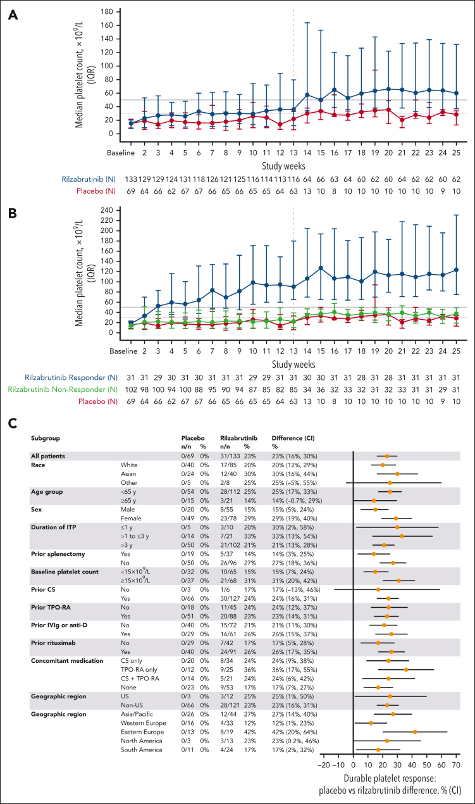{#fig-rilzabrutinib-count width=100%}

Panels A and B show medians and IQR. Continuation after week 12 depended on response,
and panel B conditions on response status; late separation is not a simple fixed-cohort
exposure effect.

Source: David J Kuter et al. (2025), [Safety and efficacy of rilzabrutinib vs placebo in adults with immune thrombocytopenia: the phase 3 LUNA3 study](https://pmc.ncbi.nlm.nih.gov/articles/PMC12824683/), [Figure 2 and original legend](https://pmc.ncbi.nlm.nih.gov/articles/PMC12824683/figure/fig2/).

[Open image at full size](platelet-kinetics-images/rilzabrutinib-count.jpg).

Reuse status: [CC BY-NC-ND 4.0](https://creativecommons.org/licenses/by-nc-nd/4.0/)

### Fostamatinib: platelet trajectories by response classification {#view-fostamatinib-count}

**Count trajectory.** Pooled FIT1/FIT2 trials; starting 100 mg twice daily, with escalation to 150 mg twice
daily in nonresponders.

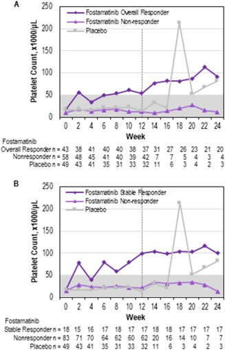{#fig-fostamatinib-count width=100%}

Both panels condition on response classification. The week-12 boundary permits
nonresponders to enter extension; these are not unselected randomized-arm medians
throughout.

Source: James Bussel et al. (2018), [Fostamatinib for the treatment of adult persistent and chronic immune thrombocytopenia: Results of two phase 3, randomized, placebo‐controlled trials](https://pmc.ncbi.nlm.nih.gov/articles/PMC6055608/), [Figure 2 and original legend](https://pmc.ncbi.nlm.nih.gov/articles/PMC6055608/figure/ajh25125-fig-0002/).

[Open image at full size](platelet-kinetics-images/fostamatinib-count.jpg).

Reuse status: [CC BY-NC 4.0](https://creativecommons.org/licenses/by-nc/4.0/)

### Fostamatinib: patient-level treatment and response duration {#view-fostamatinib-duration}

**Response-duration context.** Selected second-line fostamatinib responders.

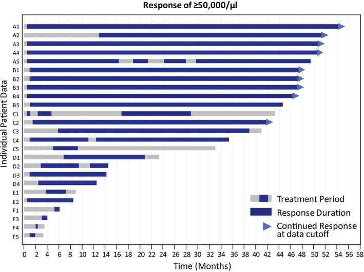{#fig-fostamatinib-duration width=100%}

Swimmer lanes separate treatment duration from maintained response. Nonresponders are
omitted, so this is a view of heterogeneity among responders rather than response
probability.

Source: Ralph Boccia et al. (2020), [Fostamatinib is an effective second‐line therapy in patients with immune thrombocytopenia](https://pmc.ncbi.nlm.nih.gov/articles/PMC7540289/), [Figure 2 and original legend](https://pmc.ncbi.nlm.nih.gov/articles/PMC7540289/figure/bjh16959-fig-0002/).

[Open image at full size](platelet-kinetics-images/fostamatinib-duration.jpg).

Reuse status: [CC BY-NC-ND 4.0](https://creativecommons.org/licenses/by-nc-nd/4.0/)

## Plasma-cell Targeting {#plasma-cell-targeting}

The static CM313 figures are accompanied by links to the publisher’s interactive
graphics, which contain additional views.

### CM313 anti-CD38: early platelet trajectory {#view-cm313-count}

**Count trajectory.** Randomized Phase 2 trial in adults with persistent/chronic primary ITP.

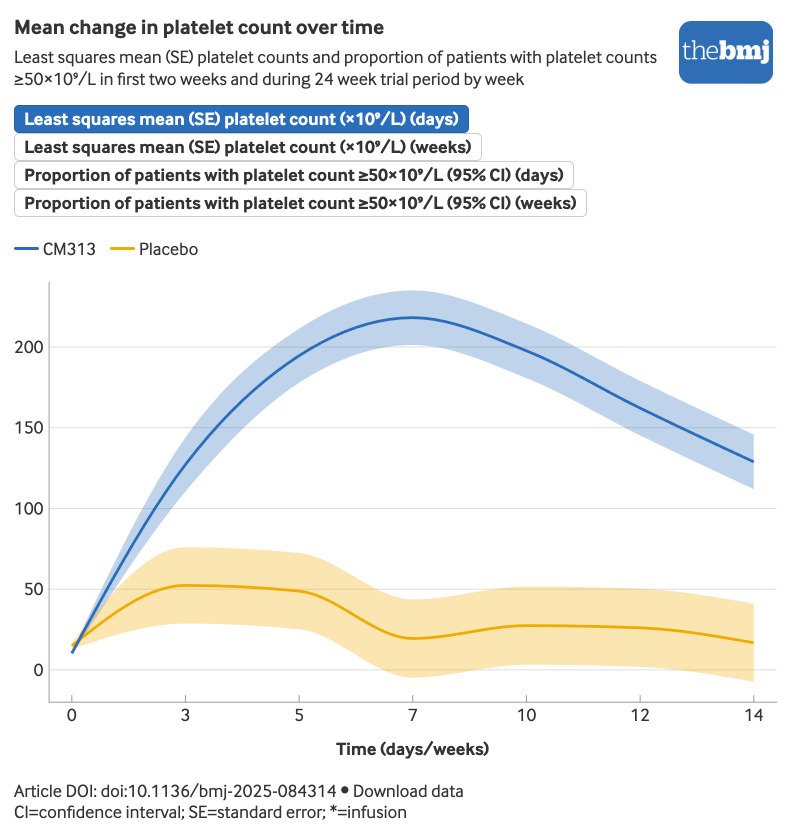{#fig-cm313-count width=100%}

The downloaded static figure shows the first 14 days of least-squares mean platelet
counts with SE bands. The labels at the top are tabs in the interactive original, not
additional panels in this JPEG; use the interactive link for the 24-week and response-proportion views.

Source: Yunfei Chen et al. (2025), [Anti-CD38 monoclonal antibody CM313 for primary immune thrombocytopenia: multicentre, randomised, placebo controlled, phase 2 trial](https://pmc.ncbi.nlm.nih.gov/articles/PMC12538382/), [Figure 2 and original legend](https://pmc.ncbi.nlm.nih.gov/articles/PMC12538382/figure/f2/).

[Open image at full size](platelet-kinetics-images/cm313-count.jpg) · [Interactive source figure](https://public.flourish.studio/visualisation/25195771/).

Reuse status: [CC BY-NC 4.0](https://creativecommons.org/licenses/by-nc/4.0/)

### CM313 anti-CD38: response patterns for individual patients {#view-cm313-duration}

**Response-duration context.** Same CM313 trial; individual lanes include response categories and concomitant
treatment.

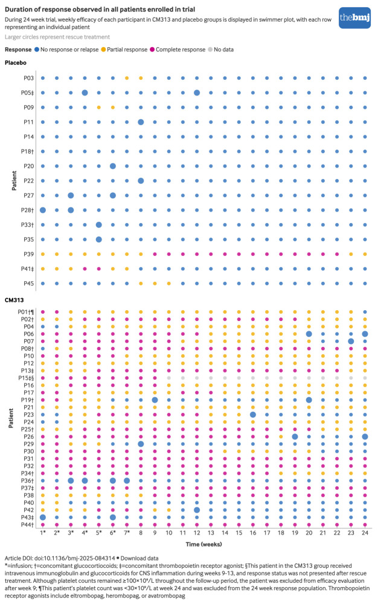{#fig-cm313-duration width=100%}

Each row follows one patient through 24 weeks; colours classify response and larger dots
mark rescue. Post-rescue data are classified as nonresponse, with one patient’s later
status omitted. The article caption describes red bars, but the static image uses
coloured dots; use its visible legend.

Source: Yunfei Chen et al. (2025), [Anti-CD38 monoclonal antibody CM313 for primary immune thrombocytopenia: multicentre, randomised, placebo controlled, phase 2 trial](https://pmc.ncbi.nlm.nih.gov/articles/PMC12538382/), [Figure 3 and original legend](https://pmc.ncbi.nlm.nih.gov/articles/PMC12538382/figure/f3/).

[Open image at full size](platelet-kinetics-images/cm313-duration.jpg) · [Interactive source figure](https://public.flourish.studio/visualisation/25276109/).

Reuse status: [CC BY-NC 4.0](https://creativecommons.org/licenses/by-nc/4.0/)

## Splenectomy {#splenectomy}

### Splenectomy: early rise and one-year follow-up {#view-splenectomy-count}

**Count trajectory.** Retrospective cohort including primary and secondary ITP, grouped by postsplenectomy
TPO-RA use.

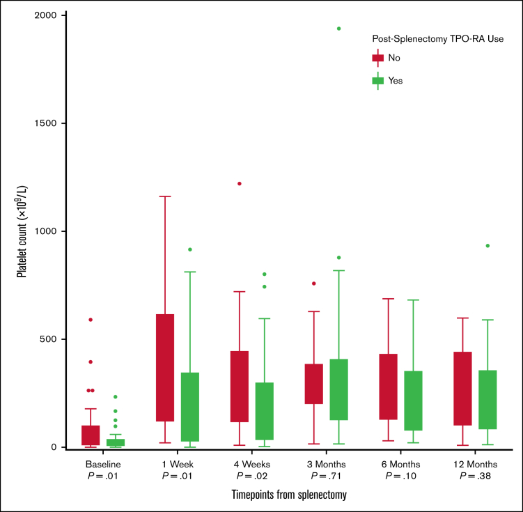{#fig-splenectomy-count width=100%}

Box plots show baseline, 1 and 4 weeks, and 3, 6 and 12 months. TPO-RA use was related
to inadequate response; the groups do not estimate a randomized TPO-RA effect. Time
intervals are unequal.

Source: Ruah Alyamany et al. (2025), [Beyond platelet counts: assessing safety of postsplenectomy TPO-RA use in ITP](https://pmc.ncbi.nlm.nih.gov/articles/PMC12666339/), [Figure 4 and original legend](https://pmc.ncbi.nlm.nih.gov/articles/PMC12666339/figure/fig4/).

[Open image at full size](platelet-kinetics-images/splenectomy-count.jpg).

Reuse status: [CC BY-NC-ND 4.0](https://creativecommons.org/licenses/by-nc-nd/4.0/)

### Splenectomy in children: individual platelet trajectories {#view-splenectomy-individual}

**Individual count trajectories.** Pediatric international registry of splenectomy in ITP.

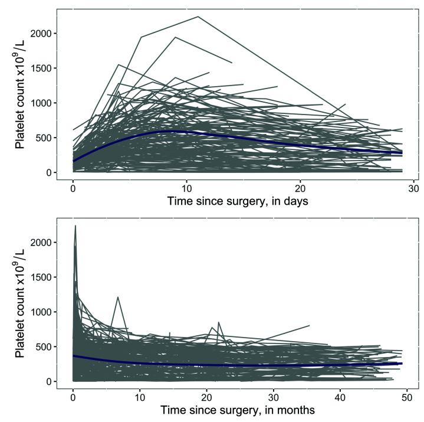{#fig-splenectomy-individual width=100%}

Individual curves show the first 30 days and approximately 50 months. The blue line is a
loess smooth, not a representative patient. Large early peaks and differing late courses
illustrate what a group summary hides.

Source: Maria L Avila et al. (2019), [Long-term outcomes after splenectomy in children with immune thrombocytopenia: an update on the registry data from the Intercontinental Cooperative ITP Study Group](https://pmc.ncbi.nlm.nih.gov/articles/PMC7604652/), [Figure 1 and original legend](https://pmc.ncbi.nlm.nih.gov/articles/PMC7604652/figure/fig001/).

[Open image at full size](platelet-kinetics-images/splenectomy-individual.jpg).

Reuse status: [CC BY-NC 4.0](https://creativecommons.org/licenses/by-nc/4.0/)

## Figures to Add

| Paper or gap | Access status | Useful images to supply |
|---|---|---|
| [Ianalumab plus eltrombopag, VAYHIT2](https://doi.org/10.1056/NEJMoa2515168) | Publisher full text returned HTTP 403 during collection | Platelet-count trajectories during eltrombopag taper and subsequent follow-up, if present in the paper or supplement; paired B-cell recovery or immunophenotype plots, if available |
| [Mezagitamab randomized Phase 2 trial](https://doi.org/10.1056/NEJMoa2513120) | Publisher full text returned HTTP 403 during collection | Platelet counts by dose through treatment and follow-up; individual courses and the treatment schedule |
| Early corticosteroid count trajectories | A suitable image was not located in the accessible papers checked; the figure above covers persistence | Daily or weekly counts after dexamethasone or prednisone, with repeat courses, taper and rescue marked |
| Paired B-cell phenotype and platelet trajectories | A directly aligned ITP example was not located | Individual counts alongside naive, memory and other relevant B-cell subsets, including treatment-free follow-up; tissue measurements where available |

Images can be placed in `platelet-kinetics-images/uploads/`. Include the paper
or DOI, figure number and original legend, especially the regimen, time origin,
rescue rules and whether the plot includes only responders. The
[upload notes](platelet-kinetics-images/uploads/README.md) give a short template.

## Sources and Image Files

Images were retrieved on 14 September 2026 and visually checked against their
linked figure descriptions. Local files retain the original source JPEGs;
only the display size changes. Entry notes are written for this collection.
The [source manifest](platelet-kinetics-images/sources.json) records source and
image URLs, DOI, retrieval date, reuse status and a SHA-256 checksum for each
file. Third-party figures retain their own copyright and licence terms.

Several source inconsistencies are recorded at the affected figures: the
rituximab mean/median description and B-cell units, the efgartigimod IgG
convention, and the CM313 static-versus-interactive presentation. These need
resolution with the source before numerical extraction. No curves were digitized
or fitted for this collection.

## Suggested First Figures

1. [Avatrombopag](#view-avatrombopag-count): count kinetics with dose adjustment,
   concomitant-medication reduction and changing follow-up numbers visible.
2. [IVIg and anti-D individual episodes](#view-ivig-antid-individual): early
   treatment effects and recurrence within a patient.
3. [Rituximab recovery](#view-rituximab-recovery): the immune-recovery association
   that needs phenotype information before it can address the reset hypothesis.
4. [Rilzabrutinib](#view-rilzabrutinib-count): how response-dependent continuation
   changes the late group trajectory.
5. [Pediatric splenectomy trajectories](#view-splenectomy-individual): individual
   variation alongside a smoothed population course.
