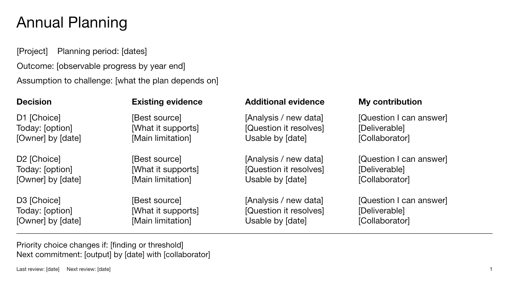

[Download the editable PowerPoint template](files/annual-planning-template.pptx).

## Filling the Slide

Use the opening lines for the project, planning period, intended outcome and the
assumption most likely to change the plan. Keep the main table to three choices
that need attention. Each row connects a decision with its evidence and a
specific contribution.

- **Decision:** the choice, current position, decision owner and deadline.
- **Existing evidence:** the most informative source and its main limitation.
- **Additional evidence:** the analysis or new data needed, with the date it
  becomes usable. Flag evidence that will arrive too late.
- **My contribution:** the question you can answer and the output you will
  deliver. Include critical review where that is the useful work.

The bottom line asks for the result that would change the highest-priority
choice and the immediate commitment. Use the [worksheet](planning-template.qmd)
for decision criteria, tradeoffs, dependencies and the full evidence plan.
Speaker notes in the PowerPoint carry the same filling guidance.
