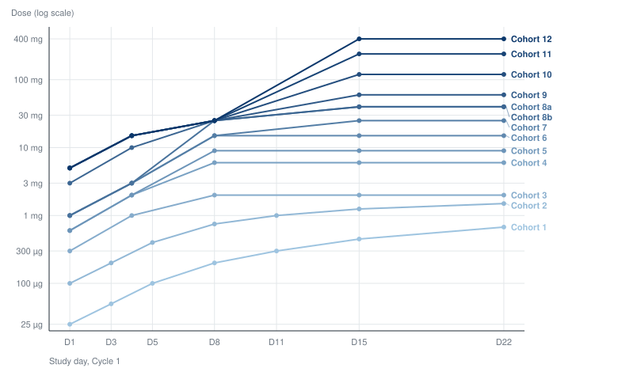

::: {.callout-note appearance="simple"}
A working document. It specifies a simulation that has not been built. Parameter values are assumptions drawn from published models rather than clinical estimates, and the conclusions in Section 26 are hypotheses to test. The [project index](index.qmd) lists the other documents in this folder, and [References](references.qmd) carries the sources.
:::

::: {.callout-tip appearance="simple"}
**This is the maintained specification.** It was forked on 2026-10-07 from [Specification 1](specification.qmd), the B-cell version, which is frozen from that date; edits go here. The design, the endpoints' structure, the trial engine and the safety sections started as the same text. What changes is the target and the marker: the engager kills plasma cells, and the stopping signal is the serum free light chain (FLC) concentration rather than the peripheral B-cell count. The sections rewritten here are the In Brief, Scope (Section 1), the nomination (Section 7), the PD model (Section 9), calibration (Section 10), PD turnaround (Section 11) and the archetypes (Section 22). Elsewhere the marker's name and threshold were substituted, a soluble BCMA note was added to Section 8, a three-patient cohort variant to Section 6, three sensitivities to Section 21 and five hypotheses to Section 26.
:::

## In Brief

**The question.** A first-in-human (FIH) T-cell engager (TCE) trial may start orders of magnitude below the biologically active dose, and conventional escalation crosses that gap one cohort at a time. Escalating within a patient crosses it faster. The simulation asks whether intrapatient dose escalation (IPDE) gets the trial to a confirmed active dose sooner, and whether the time saved outweighs the extra visits, doses and hospital time. Depending on the scenario it can save more than it costs, cost more than it saves, or come out even. Section 1 sets out the three axes the answer is reported on.

**Why it might work.** The value of IPDE grows with uncertainty about the gap between the starting dose and the active dose. A large gap that was predicted well is crossed efficiently by conventional escalation, and IPDE helps only when the prediction is wrong by a large factor. For that reason prediction error is the primary simulation axis (Section 12).

**The marker.** A plasma-cell engager needs a readout of plasma-cell killing that moves within days. Serum immunoglobulin G (IgG) has a half-life of about three weeks, so a fall in IgG or in a myeloma M-protein reports a kill weeks after it happened, and a bone-marrow biopsy cannot be repeated weekly. Serum FLC are secreted by plasma cells and cleared by the kidney with a half-life of a few hours, so the serum level follows plasma-cell mass within a day of a change. A peripheral B-cell count, the marker in Specification 1, stays in the design as a second readout where the target is also on B cells (Section 22).

**The design.** One scout patient escalates weekly until serum FLC falls below 10% of that patient's baseline, then stops. Where a single patient at a new dose is not acceptable, as may be the case in immunology, three scouts climb the ladder together (Section 6). The scout's ladder is not an interpretable regimen, so it nominates a dose neighbourhood: three fresh patients then receive a conventional step-up regimen at the nominated target, and only those three count toward the primary endpoint (Section 4).

**What cannot be quantified.** A scout escalating weekly can outrun a toxicity that takes longer than a week to appear, so a normal observation at the next dose decision is incomplete reassurance. For cytokine release syndrome (CRS) the ladder may be protective, since the scout arrives at each dose better primed (Section 14). For immune effector cell-associated neurotoxicity syndrome (ICANS) no published exposure-response model supports simulating the risk, and this document does not invent one (Section 16). That gap limits the strategy, not only the simulation.

```{mermaid}
flowchart TD
    A["Large uncertainty about the active dose"] --> B["Rapid within-patient traversal"]
    B --> C["First strong pharmacologic signal"]
    C --> D["Stop escalating"]
    D --> E["3-patient conventional backfill<br/>at the nominated target dose"]
    E --> F["Ordinary expansion / dose optimisation"]
```

**Reading the result.** The simulation weighs a benefit it can quantify against a risk it cannot, so no part of the result is a recommendation by itself. It shows where the saving is large enough for the safety discussion to be worth having. A saving under about eight weeks, one conventional cohort cycle plus its accrual, sits inside the noise of ordinary trial execution. Section 26b reads the map.

------------------------------------------------------------------------

## 1. Objective

The simulation and operational framework answer one question:

> Under what conditions does intrapatient dose escalation (IPDE) materially shorten the time a first-in-human T-cell engager study needs to reach and conventionally evaluate a biologically active dose or regimen, or reach that point in the same time having treated fewer patients at subtherapeutic exposures, and what safety and operational risks come with either?

**The saving can arrive on three axes.** It can be calendar time, patients, or clinical workload (visits and hours of observation or hospitalization), and a design can win on one axis and not the others. Catch-up escalation is expected to be such a design: little change in the time to an evaluated active dose, and substantially less patient-time at clearly subactive doses (Section 6). Scored on time to an evaluated active dose alone, it would count as a failure.

### Headline Metrics

The definitions here are enough to read the rest of the document. Sections 4, 5 and 19 give the full rules.

**Profound FLC suppression** is a serum free light chain concentration $L$ below $\theta_{\rm stop}L_0$, where $L_0$ is that patient's baseline and $\theta_{\rm stop}=0.10$ in the base case (Section 9). It is the trial's observable evidence that a dose is active.

Time (Section 4):

- $T_{3,\rm eval}$, the primary endpoint: calendar time from the first dose in the study until 3 patients have completed the full evaluation window $W_{\rm full}$ on a conventional regimen whose target dose produced profound FLC suppression in those patients. Patients who reached the target dose through an IPDE ladder do not count.
- $T_{\rm FLC}$, the secondary endpoint: calendar time from the first dose to the first observation of profound FLC suppression in any patient.
- $\Delta T = T_{3,\rm conventional} - T_{3,\rm IPDE}$, the time IPDE saves. A positive value favours IPDE.

Patients (Section 5):

- $N_{\rm sub}$, the number of patients treated only at subactive exposures, scored by the simulator, which knows the true active dose. $\Delta N_{\rm sub}$ is its reduction against the conventional comparator.
- The number of patients enrolled before the first profound FLC suppression.
- Patient-weeks with FLC at or above $\theta_{\rm stop}L_0$.

Clinical workload (Section 19):

- Total patient-visits.
- Total observation and hospitalization time, in patient-hours.

**Report the third axis per patient and per trial.** The two can point in opposite directions. A scout takes a visit, a dose, a pharmacy preparation and an observation window at every rung, where a conventional patient sits at one dose level for the same period, so per patient the ladder is heavier. Across the trial it may be lighter, because there are few scouts and conventional escalation puts three patients on every rung. The per-patient count says what a participant undergoes and the per-trial count says what the sites and the sponsor carry. Section 19 expects the per-patient cost to depend on what the patients were already scheduled for: close to nothing for a weekly (QW) oncology TCE whose visits are planned anyway, and substantial for an immune-reset programme whose eventual treatment is one or two administrations.

**No cost model yet.** Combining visits, doses, hospital hours and patients into one number needs weights, and a sponsor, a site and a patient weigh them differently. Section 19 reports the components separately, and a programme that wants a currency figure can price its own counts.

### Output: A Map of the Design Space

The deliverable is $\Delta T$, $\Delta N_{\rm sub}$ and the burden counts reported across the scenario grid in Section 21, with the regions where each is material named. It says which conditions favour IPDE and does not decide for any one programme.

**Read the result against contours.** An eight-week saving is a line drawn on the map, roughly one conventional cohort cycle plus its accrual, where the cycle is the base-case 28 days $W_{\rm cohort}$ between the last patient in a cohort receiving the target dose and the next dose level opening (Section 15). A smaller saving sits inside the noise of ordinary trial execution and is marked as such. A programme applying this work later brings its own threshold. Section 26b covers reading the map, including where the saving is patients rather than time.

**The safety side stays unquantified.** Section 16 sets out why no defensible quantitative ICANS model exists. A region of the map says whether the benefit there is large enough for the safety discussion to be worth having, and nothing more.

When this work starts supporting a specific programme decision, fix the threshold in advance, so the team is not negotiating it against results it has already seen. That step is outside this document.

### Scope

The main use case is a **plasma-cell-depleting TCE**, with profound suppression of serum FLC as the rapid pharmacodynamic (PD) signal. The targets in view are those on plasma cells: B-cell maturation antigen (BCMA), G protein-coupled receptor class C group 5 member D (GPRC5D) and Fc receptor-homolog 5 (FcRH5) in myeloma, and BCMA in autoimmune disease, where it removes the long-lived plasma cells that anti-CD20 therapy leaves behind.

**Two populations, two FLC measures.** In myeloma the tumour secretes one light chain type, and the marker is the involved FLC, kappa or lambda. In autoimmune disease and in healthy volunteers the plasma cells are polyclonal, and the marker is the sum of kappa and lambda. The kappa/lambda ratio, the usual diagnostic readout, does not move when polyclonal plasma cells are depleted evenly and is not used as a signal.

**The B-cell design is [Specification 1](specification.qmd).** Where the target is on both compartments, as with a CD19 x BCMA engager, Archetype 3 in Section 22 carries both markers.

**Out of scope: raising the starting dose.** A better minimal anticipated biological effect level (MABEL) starting dose attacks the same gap from the other end and complements IPDE. This project holds $D_{\rm start}$ fixed and varies what happens above it.

**Out of scope: later development.** IPDE is a first-in-human strategy for an uncertain active dose. Once the active neighbourhood is known, the reason to cross a large dose range within one patient mostly disappears.

Two further archetypes are, as a negative control, another BCMA TCE, where class knowledge should predict the active dose well and leave IPDE little to gain, and a dual B-cell and plasma-cell target (Section 22). The solid-tumour archetype stays in Specification 1, since it has neither marker.

### Healthy Volunteer Studies

Recorded 2026-09-10. A related idea: give healthy volunteers one or two doses, climbing between cohorts until the first grade 1 cytokine release or a 50% fall in peripheral B cells, or for a plasma-cell target in summed FLC, and open the patient study at that dose. A phase 1 unit climbs a ladder in weeks where a patient escalation takes months, and the ladder runs across volunteers, so where volunteers can be dosed the design simulated here may not be needed.

Three TCEs have registered healthy volunteer cohorts since December 2025, all for autoimmune indications and all with an affinity-tuned CD3 arm. No oncology TCE has been given to a volunteer. [T-cell engagers in healthy volunteers](tce-hv.qmd) carries the studies, what a volunteer study can measure, the translation to patients, and a speed estimate.

One of the three, cizutamig, is a BCMA x CD3 engager, so a plasma-cell target has already been given to volunteers. A volunteer has a normal polyclonal plasma-cell compartment and a normal FLC level, which makes summed FLC a readout a volunteer study can use, where a B-cell count says little about a BCMA engager. What cizutamig's volunteer study measured is not known; entry 21 of the references asks.

**How it bears on this simulation.** The volunteer route is the higher-starting-dose strategy set aside in the Scope, with human data behind it. Where it is open, in a plasma-cell-depleting TCE for an autoimmune indication, it removes most of the prediction error in Section 12 and is the stronger alternative; the simulation then reports what IPDE would have saved, as a comparator. Where it is closed, in myeloma, the question stands as specified.

**Open decision.** The main use case does not yet name its indication. That choice settles whether the volunteer design enters the scenario grid of Section 21 as a comparator.

------------------------------------------------------------------------

## 2. Central Hypothesis

The value of IPDE comes from crossing a probably subtherapeutic dose range quickly. What decides it is uncertainty about $D_{\rm active}/D_{\rm start}$ more than the ratio itself, expressed as the prediction error

$$
E_{\rm pred} =
\frac{D_{\rm true,active}}{D_{\rm predicted,active}}.
$$

If the prediction is accurate, conventional escalation may already reach the active range efficiently. If it is wrong by 10 to 30-fold or more, IPDE may accelerate the trial substantially. Prediction error is therefore a primary simulation axis (Section 12).

------------------------------------------------------------------------

## 3. Scouting Versus Confirming a Regimen

IPDE is a scouting strategy. A scout might receive $0.1\rightarrow0.3\rightarrow1\rightarrow3\rightarrow10$ mg and show profound FLC suppression after the 10 mg dose. That does not characterize a conventional 10 mg regimen, because the response followed a sequence of earlier doses.

> IPDE identifies the candidate dose neighbourhood. A separate conventional backfill cohort tests an actual candidate regimen.

The endpoints in Section 4 and the backfill rules in Section 7 are built on this split.

------------------------------------------------------------------------

## 4. Primary and Secondary Endpoints

### Primary Endpoint

$T_{3,\rm eval}$ is the calendar time from the first dose in the FIH study until 3 patients have been fully evaluated on a conventional candidate regimen whose target is the biologically active dose. These 3 patients must not be patients who reached the target through an exploratory IPDE ladder.

For IPDE the clock runs through five events:

1.  The scout reaches profound FLC suppression.
2.  A candidate target dose is nominated.
3.  A backfill cohort opens.
4.  3 new patients receive a standard candidate regimen.
5.  All 3 complete the full safety and PD evaluation window.

For conventional escalation, the 3 patients in the first cohort at an active dose count themselves, since they received an interpretable regimen from the start. The comparison is therefore conservative toward IPDE, by design.

### Endpoint Rules Use Observables Only

The trial never observes $D_{\rm true}$, so the computable definition is:

> $T_{3,\rm eval}$ is the calendar time until 3 patients complete the full evaluation window $W_{\rm full}$ on a conventional candidate regimen **whose target dose produced profound FLC suppression in those same patients**.

Both designs confirm by observed PD in the confirming cohort:

- Conventional: between-patient escalation stops at the first cohort whose patients reach $L<\theta_{\rm stop}L_0$, and those 3 patients count.
- IPDE: the backfill cohort counts only if its patients reach $L<\theta_{\rm stop}L_0$ on the nominated regimen. A backfill cohort that does not deplete triggers the re-escalation rule in Section 7, and the clock keeps running.

The two failure directions are scored differently on purpose. A nomination that is too low costs calendar time inside $T_{3,\rm eval}$, through the backfill rule in Section 7. A nomination that is too high does not extend $T_{3,\rm eval}$, and the dose-selection operating characteristics in Section 5 score it instead.

### Secondary Endpoint

$T_{\rm FLC}$ is the time to the first observation of profound FLC suppression, $L<\theta_{\rm stop}L_0$, where $L$ is the serum FLC concentration, $L_0$ that patient's baseline, and $\theta_{\rm stop}=0.10$ in the base case (Section 9). Call it time to first profound FLC suppression; it does not identify the dose responsible.

The threshold is a fraction of the patient's own baseline because FLC has no population floor comparable to 5 B cells/µL: the polyclonal reference interval spans about six-fold, and a myeloma patient's involved FLC can sit anywhere above 100 mg/L. A fractional threshold also keeps the endpoint the same in both populations.

The difference $T_{3,\rm eval}-T_{\rm FLC}$ is the **confirmation penalty**, the time spent confirming after the scout's discovery.

------------------------------------------------------------------------

## 5. Operating Characteristics and Other Outputs

Three families, all computable from what the simulated trial observes, plus the simulator's knowledge of $D_{\rm true}$ for scoring after the fact. Deterministic Phase 1 gives a single value for each. Once enrollment stochasticity (Phase 2) and interindividual variability (IIV, Phase 4) enter, report the median and the 10th to 90th percentile across replicates.

### Speed

- $T_{\rm FLC}$ and $T_{3,\rm eval}$ (Section 4).
- $\Delta T = T_{3,\rm conventional} - T_{3,\rm IPDE}$, and once stochastic, $P(\Delta T>0)$ and $P(\Delta T>4\ {\rm weeks})$.
- Probability of confirming an active regimen within the administrative horizon. Once IIV enters, a scout or backfill patient who never depletes makes this less than 1.

### Dose Selection

The trial cannot see $D_{\rm true}$, so the simulator scores selection after the fact:

- Confirmed target dose relative to $D_{\rm true}$, in grid steps (below, at, above).
- Number of nomination-confirmation cycles before a regimen confirms (Section 7).
- Number of patients exposed above $D_{\rm true}$.

With the endpoint rule in Section 4, this defines "right" for the design: too low shows up as calendar time, in extra confirmation cycles inside $T_{3,\rm eval}$, and too high shows up as overshoot here and in the exposure counters below. Neither is hidden inside the endpoint definition.

### Patient and Operational Cost

- Number of patients enrolled before the first profound FLC suppression.
- Patient-weeks with FLC at or above $\theta_{\rm stop}L_0$.
- Number of patients treated only at subactive exposures.
- Total doses administered.
- Number of safety-review decisions.
- Extra visits relative to conventional treatment.
- Hospitalization and observation time.
- Delayed or cumulative toxicity in the neutropenia stress test.

**Not endpoints in v1:** EC50 precision, bias in the plasma-cell exposure-response model, dose-response estimation efficiency, the probability of correctly estimating an active dose range, and clinical efficacy. Each is a fair question for later and would distract from the current one.

------------------------------------------------------------------------

## 6. Designs to Compare

Four designs, varying two things independently: how many patients sit at each low dose level, and whether a patient may move up within their own treatment.

| Design | Low-dose cohort | Within-patient escalation | Escalation stops when |
|:-----------------|:-----------------|:-----------------|:-----------------|
| **Conventional** (A) | 3 patients | None | A cohort reaches profound FLC suppression. |
| **Accelerated** (A2) | 1 patient, reverting to 3 once activity or toxicity appears | None | As conventional. |
| **Catch-up** (B) | 3 patients | A patient already enrolled may move up to a dose the trial has since cleared | As conventional. |
| **Scout-and-backfill** (C) | 1 scout | The scout leads the escalation on a weekly ladder | That scout's FLC falls below $\theta_{\rm stop}L_0$. A fresh conventional cohort then confirms the nominated dose. |

: The four designs

Each of three contrasts isolates one mechanism:

- **A against A2** is the micro-cohort effect: fewer patients per rung, nothing else changed.
- **A against B** is within-patient escalation, since both keep 3-patient cohorts and the same escalation decisions.
- **A2 and B against C** asks whether prospective scouting delivers more than the two mechanisms separately, and what the PD stop adds.

Simon's comparison has the same shape, varying the escalation scheme and intrapatient escalation independently. Reporting only A against C would credit scouting with a saving that a 1-patient cohort produces by itself.

Conventional, accelerated and catch-up escalate the trial. Only scout-and-backfill escalates a patient toward an unknown dose, and only it stops on pharmacology rather than at a cohort review.

### Prior Art

Catch-up and scout-and-backfill are not new in structure. The accelerated titration designs of Simon and colleagues (*J Natl Cancer Inst* 1997;89:1138--1147) combine single-patient cohorts at low doses with intrapatient escalation for patients who show neither response nor toxicity. Catch-up is that mechanism, and Design A2 belongs to the same family. The new element is the **stopping rule**: Simon's patients escalate on a fixed schedule until toxicity or response, while a scout escalates until a PD threshold fires and then hands off to a conventional cohort.

The paper has been read and checked, and the [reading notes](simon97-notes.qmd) carry its numbers with page citations. Simon numbers his designs 1 to 4 and letters his intrapatient options A and B; neither matches this document's designs.

**Simon's finding: intrapatient escalation moves no clock.** Adding it changes neither the number of patients nor the number of cohorts, in the standard or the accelerated design. It moves patients out of undertreatment: those whose worst toxicity was grade 0--1 fall from 23.3 to 19.3 in the standard design. Time comes from dose step size. No table in the paper splits the intrapatient options, so the size of the time effect is unpublished, and a literature search found no other paper that quantifies it.

Three consequences:

1.  The **catch-up helps patients, but not time to evaluate active dose** hypothesis in Section 26 is supported in direction and unquantified in size. Cite Simon for the direction; the simulation still has to produce $\Delta T$.
2.  The efficient conventional comparator is Simon's design 3 with option A, which is Design A2.
3.  The dose escalation factor (Section 13) is the mechanism, not a nuisance parameter. Simon's accelerated ladder moves about 2-fold per double step and about 3.3-fold at the first step. A fixed scout ladder holds about 3.3-fold throughout, and the PD-guided rule in Section 13 takes 10-fold steps until the marker moves.

**Immunology escalates within patients too**, and in the autoimmune cytopenias it is ordinary practice. Rilzabrutinib's phase 1--2 in immune thrombocytopenia steps each patient up every 28 days on platelet response. Its pemphigus study gates the step on clinical response and Bruton tyrosine kinase (BTK) occupancy, a target-engagement marker doing the job FLC does in Section 13. A first-in-human study in Graves' disease is registered as a within-subject dose-escalating design. The second reading queue on the [references page](references.qmd) carries these, unread, so this paragraph reports a search rather than a set of papers.

These immunology ladders climb until the patient responds, and stop because the patient is treated. A scout climbs until the marker moves, and stops because the programme has found its dose. The search found no ladder whose purpose is to nominate a dose for a separate confirming cohort, so the stopping rule and the scout-and-backfill split are what is new here.

The accelerated titration literature stops on toxicity and seeks a tolerated dose. It has no PD stopping rule, no scout-and-backfill split and no confirming cohort, so it says nothing about $T_{3,\rm eval}$, the confirmation penalty or the prediction-error axis. Those, and the value of the PD stop, are what the simulation has to show.

**Out of scope: model-based escalation** (the continual reassessment method (CRM), Bayesian optimal interval (BOIN) design and their variants). These allocate patients across dose levels more efficiently under a toxicity model, and the binding constraint here is pharmacology in a range believed subtherapeutic. Section 27b gives the reasons for deferring them and what would bring them back.

### Design A: Conventional Escalation

Patients receive a conventional TCE regimen: a step-up dose, then the target dose.

**Base case: one step-up dose.** No step-up is unrealistic for a modern TCE, and two step-ups make the conventional arm slower than it needs to be, which favours IPDE. Two step-ups are the sensitivity analysis.

The base schedule is $SUD$ on D1 and $D_{\rm target}$ on D4, then QW target dosing if needed. Teclistamab steps up through 0.06 and 0.3 mg/kg before its 1.5 mg/kg target, about 4% and 20% of the target. With one step-up, take the higher: $SUD = 0.20D_{\rm target}$. The two-step sensitivity uses $SUD1 = 0.04D_{\rm target}$ and $SUD2 = 0.20D_{\rm target}$ on D1 and D4, with the target on D8. The fractions are a reference regimen, not a biological constant.

After safety review of dose level $D_k$, a new cohort receives $D_{k+1}$.

### Design A2: Accelerated Escalation

One patient per dose level in the low-dose region, reverting to 3-patient cohorts once activity or toxicity appears. Everything else matches Design A: the same step-up regimen, the same between-cohort review, and no within-patient escalation.

A2 is a design rather than a sensitivity analysis because it is the comparator a clinical team will propose (Objection 3 in Section 27). Published TCE programmes run small early cohorts across very large dose ranges, so a conventional design with 3 patients at every very low dose would be a straw man. As its own design, A2 also reports the micro-cohort saving separately instead of folding it into the scouting result.

Use Simon's design 3 with option A: single-patient cohorts, double dose steps, no intrapatient escalation, and a return to the standard design at the first first-course dose-limiting toxicity (DLT) or the second first-course grade 2 event.

Two parameters:

- $n_{\rm low}$: patients per cohort in the low-dose region. 1 here, 3 in Design A.
- **The rule that ends the accelerated phase.** Simon's is a toxicity event. A PD variant ends it at the first sign of FLC movement. That is the signal scout-and-backfill stops on, so running it separates the trigger from the escalation mechanism.

### Design B: Catch-Up Escalation

Between-patient escalation and the opening of new dose levels follow Design A. In addition, a patient enrolled at a low target dose may move up to a higher one once the trial has cleared it.

A patient in the 1 mg cohort receives $0.3\rightarrow1$ and under Design A stays at 1 mg. Under catch-up the same patient follows $0.3\rightarrow1\rightarrow3\rightarrow10$ as each level is cleared, one administration a week. The trial's between-patient escalation opens the higher levels, so catch-up changes which patients sit at a dose level and not when the level opens.

Expected result: little or no improvement in $T_{3,\rm eval}$, and a substantial reduction in patient-time at clearly subactive doses. The design separates **patient benefit** from **programme acceleration**.

### Design C: Scout-and-Backfill

The design this project exists to evaluate. After initial priming, one or more scout patients escalate prospectively,

$$
D_0\rightarrow D_1\rightarrow D_2\rightarrow D_3\rightarrow\dots,
$$

one step every 7 days. Escalation continues while $L\ge\theta_{\rm stop}L_0$ and the protocol's safety gate permits another dose, and stops when $L<\theta_{\rm stop}L_0$. The trial then nominates the corresponding target-dose neighbourhood and opens conventional backfill at once.

**Step interval: one week in v1.** It matches the safety gate $W_{\rm decision}$ in Section 15 and the PD turnaround in Section 11, so nothing else in the engine has to change. Shorter intervals are a later question.

#### No Cap on the Number of Steps

Do not cap the number of escalations at, say, three. If the scout is still underdosed and meets the safety criteria, continuing to escalate is the hypothesis under test. MCLA-117, below, gave seven within-patient doses in 22 days with no cap.

An uncapped number of steps is different from an unlimited dose. A real protocol has a maximum permitted dose or exposure, set by nonclinical safety, manufacturing and protocol amendment, and the simulation needs a technical upper dose so an inactive virtual molecule cannot escalate forever. Treat that bound as administrative censoring, separate from the scientific stopping rule.

### Precedent: The MCLA-117 Ladder

The MCLA-117 (tepoditamab) first-in-human study in acute myeloid leukaemia (AML) escalated within patients from a 25 µg first dose to a 400 mg target, a factor of 16,000; cohort 1 took seven doses in 22 days.

{#fig-mcla117}

Three features bear on this design. The [MCLA-117 notes](mcla117-notes.qmd) carry the dose tables and the caveat that they were transcribed from an image of the poster.

- The number of within-patient steps was not capped.
- The first dose rose slowly between cohorts, by 4-fold at most and mostly 3-fold or less, while the target dose rose 600-fold over the same cohorts. The constraint falls on the first dose in a drug-naive patient, which the next subsection takes up.
- From cohort 9 the step-up prefix is fixed at 5, 15 and 25 mg and only the target changes. Section 7 assumes the same structure for the backfill regimen.

The step interval differs. Cohort 1 escalated every 2 to 3 days, where the scout escalates weekly, so the simulated ladder is slower than the precedent and any acceleration it reports is conservative on that axis.

### Scout Entry: The First-Dose Limit and a Second Scout

As specified so far, a scout begins at $D_{\rm start}$ and climbs without limit. Two constraints change that, and they interact.

**The first dose in a drug-naive patient rises slowly between cohorts.** The nonclinical argument that sets the FIH starting dose governs it too, and a safety committee accepts only a modest multiplier: 3-fold typically and 4-fold at most in MCLA-117. A second scout therefore cannot begin where the first stopped.

**One scout is one patient.** A nomination from a single scout rests on one patient's FLC trajectory, and a programme may want a second scout to reproduce it before opening backfill.

Together these cost calendar time only when the scouts run in series. A second scout who starts near the bottom after the first has finished repeats most of the first ladder, and confirmation takes nearly as long as the discovery did. Running the scouts concurrently removes most of that cost, as the next subsection describes.

Parameters:

- $F_{\rm start}$: the maximum between-cohort multiplier on the first dose in a drug-naive patient. Base 3; sensitivities 2 and 10, where 10 stands for effectively unconstrained.
- $n_{\rm scout}$: the number of scout patients. Base 1; sensitivities 2 and 3.
- **Scout entry policy**, one of: a fixed low first dose for every scout; the highest dose already cleared by a previous scout; or the previous scout's first dose times $F_{\rm start}$.

#### Rolling Scout Entry

A second scout need not wait for the first to finish. Once the leading scout has cleared a rung, the rung is cleared for anyone, so following scouts enter on a rolling basis, each one or more rungs behind the one ahead, and the ladder carries several patients at once.

Two limits on the stagger, which a protocol has to state:

1.  **A follower's next dose waits on the leader's result.** The PD result and safety review for rung $k$ arrive $T_{\rm PD,ready}$ plus the review lag after the leader's dose (Section 11). Dosing a follower at rung $k$ sooner puts two patients at an uncleared dose and gains nothing over dosing them together. The minimum stagger is the turnaround, not the escalation interval.
2.  **Sentinel rules limit the first dose in each patient.** A protocol that staggers first doses between patients applies the stagger to scouts too, and that gap is usually longer than the PD turnaround.

A follower never enters a rung the leader has not cleared. When the leader triggers the stop, each follower climbs to that dose and stops there, which gives the declaration in Section 4 its observations at the nominated dose.

**Rolling entry costs patients inside the latency window.** A scout escalates on acute safety before delayed toxicity from earlier rungs is observable (Section 15). Three scouts a rung apart share that risk, so a delayed signal at rung $k$ arrives with three patients dosed past it rather than one. $\Delta T$ does not show this. Report the number of patients dosed above a rung when that rung's delayed-toxicity information arrives, beside the burden rows in Section 19.

Parameterize the stagger as $\Delta_{\rm scout}$, the gap between successive scout entries: base one rung; sensitivities two rungs and the serial case, where the next scout starts only after the previous one stops. The serial case shows what concurrency bought.

What real protocols do here is not known. It is the question the GB261 entry on the [references page](references.qmd) asks: what ended the accelerated phase, and whether the patient who triggered it stopped alone or everyone stopped. Answer it from a protocol before fixing the rule.

#### One Patient Stops the Ladder; Three Declare the Dose

**The first scout to reach** $L<\theta_{\rm stop}L_0$ ends the accelerated phase. Act on the first value below the threshold and confirm afterwards for the record; a repeat sample before acting only delays the stop.

One patient stops the ladder and three declare the dose (Section 4). The asymmetry will be challenged, so the reason belongs in the protocol. The two errors point in opposite directions. One patient's depletion is a noisy observation, and an atypical patient can cross the threshold at a dose the population would not; that error ends the accelerated phase early and costs speed. Waiting for two or three would keep scouts climbing past a dose already shown to be active in someone, which cannot be undone. Declaring $D_{\rm true}$ on one patient would overclaim, which is why the declaration keeps three.

Simon accepts the same asymmetry: his accelerated phase ends on the first qualifying event in any patient. Reusing a trigger that protocols already carry makes the ethics discussion a question of precedent.

The confirmatory-sample question in Section 13 is a different rule. It governs $\theta_{\rm move}$, the threshold that slows the ladder, where a false positive costs acceleration over all the remaining rungs. This rule governs the stop, where a false positive costs one rung.

If two scouts deplete at different dose levels, Section 7 still needs a single $D^*$. Nominating the lower is the conservative choice, and when it is too low it costs the non-confirmation cycles of Section 7.

### Variant: Three-Patient Cohorts Throughout

Designs A2 and C both put a single patient at a dose no one has received before. Oncology accepts that, with Simon's accelerated titration and the MCLA-117 ladder as precedent. Immunology may not, since an autoimmune patient is not out of options and a safety committee may want acute safety data from three patients before a new dose level is given again. This variant keeps the unit of escalation at 3 patients everywhere, and the indication chooses between it and the base case.

Two designs change:

- **A2 drops out.** With $n_{\rm low}=3$ it is Design A, so the conventional comparator is A.
- **C becomes a three-patient scout cohort**, C3. Three scouts start together at $D_{\rm start}$ and climb the same ladder, each rung given to all three in the same week, subject to the sentinel rule for first doses (Section 20). In the notation above, $n_{\rm scout}=3$ and $\Delta_{\rm scout}=0$. The safety gate at each rung reads all three patients.

The rest of the design holds. The first of the three to reach $L<\theta_{\rm stop}L_0$ stops the ladder for all three, as in the subsection above; a 2-of-3 stop is the sensitivity. The scouts' ladder is still not an interpretable regimen, so three fresh backfill patients declare the dose (Sections 4 and 7).

**What the variant costs.** Three patients sit at every subactive rung instead of one, so $\Delta N_{\rm sub}$ against Design A shrinks. A delayed-toxicity signal at a rung arrives with three patients dosed above it (Section 19). The ladder cannot start until three patients are ready, which takes days under the fast accrual expected in immunology and weeks under slow accrual.

**What it buys.** The nomination rests on three FLC trajectories instead of one, so an atypical scout is less likely to stop the ladder early, and the safety committee sees three patients at each rung before the next.

**What it does to the comparison.** C3 against A isolates within-patient escalation and the PD stop, with no micro-cohort effect mixed in, which is a cleaner contrast than C against A. The time saving should survive, because a rung of the scout ladder costs one escalation interval whether one patient climbs it or three, while each rung of Design A costs a between-cohort review. The patient saving at subactive doses mostly does not (hypothesis 21).

Parameterize as $n_{\rm unit}$, the number of patients in each escalation unit at doses not yet cleared: 1 in the base case, 3 in this variant. Run the myeloma population at 1 and the autoimmune population at 3 (Section 22), and both values in each population as a sensitivity.

------------------------------------------------------------------------

## 7. Candidate Backfill Regimen

If scout depletion first follows target $D^*$, nominate the base-case conventional regimen $0.20D^*\rightarrow D^*$ on about D1 and D4, matching Design A's step-up so the two are comparable. Under the two-step sensitivity, nominate $0.04D^*\rightarrow0.20D^*\rightarrow D^*$ on D1, D4 and D8. Enrol 3 fresh backfill patients on that regimen. The scout's full ladder is never the candidate regimen.

**Sensitivity: reuse the scout's preceding doses as the step-up**, one dose under the base case and two under the two-step sensitivity. If the scout's history was $1\rightarrow3\rightarrow10\rightarrow30$ and 30 mg produced depletion, the backfill regimen is $3\rightarrow10\rightarrow30$. Start with the fixed-ratio rule, because it makes comparisons cleaner.

### Expect the Nomination to Sit Low

The scout's stopping signal comes from the cumulative exposure and plasma-cell trajectory of the whole ladder, not from $D^*$ alone. Drug from earlier doses is still present when the signal fires: the retained PK gives an effective half-life of about 8 days ($\ln 2 \times V_{ss}/CL$) against a 7-day interval. Plasma cells recover more slowly still ($t_{1/2,P}\approx60$ days in the base case, Section 9), so partial depletion carries over from step to step. $D^*$ can therefore sit one or more grid steps below the dose whose conventional regimen suppresses FLC in a fresh patient.

**The carryover is larger here than in the B-cell design.** The marker carries no memory, since FLC is cleared within hours, but the cells it reports on recover about half as fast as B cells in Specification 1. Hypothesis 18 in Section 26 states the prediction.

The PD-guided rule in Section 13 is the main lever against this, since a scout that slows once the marker moves stops nearer the dose responsible. Backfill non-confirmation is an expected event that the protocol must handle.

### Backfill Confirmation and Non-Confirmation

- **Confirmation.** The backfill regimen confirms when its patients reach $L<\theta_{\rm stop}L_0$ at the prespecified PD assessment time. In the deterministic phases this is all-or-none in the reference patient. An $x/3$ rule, such as at least 2 of 3, waits for Phase 4 and IIV.
- **Non-confirmation.** Raise the candidate target dose one grid step and enrol a new 3-patient conventional cohort at that level. Repeat until a cohort confirms or the administrative dose cap is reached. After a failed backfill, the IPDE arm is running conventional escalation from $D^*$ instead of $D_{\rm start}$, and the time this takes stays inside $T_{3,\rm eval}$.
- **Patients in a failed backfill cohort** may step up to the next candidate dose under the catch-up rules, for their own benefit, but no longer count toward $T_{3,\rm eval}$.

------------------------------------------------------------------------

## 8. PK Model

Use published teclistamab population PK as the reference exposure model: subcutaneous first-order absorption, two-compartment disposition, and parallel time-independent and time-dependent clearance. Teclistamab is a BCMA x CD3 engager, so in this variant the reference model belongs to the class being simulated.

| Parameter             |             Value |
|:----------------------|------------------:|
| $CL_1$                |       0.449 L/day |
| $V_c$                 |            4.13 L |
| $Q$                   |      0.0390 L/day |
| $V_p$                 |            1.34 L |
| $k_a$                 |  0.133 day$^{-1}$ |
| $F$                   |             0.718 |
| time-dependent $CL_2$ |       0.547 L/day |
| $k_{\rm DES}$         | 0.0292 day$^{-1}$ |

: Published teclistamab population-PK typical estimates

**Omit the time-dependent clearance** $CL_2$ and keep $CL=0.449$ L/day. Time-varying clearance is real for teclistamab but not central to the trial-design question. The result is a teclistamab-structure model simplified to time-independent disposition, and it should not be described as the approved teclistamab model. It keeps exposure persisting on about the weekly scale, which is what this exercise needs.

Use a 74 kg reference patient, about the reference weight in the published model, and no covariates in v1. Omit PK IIV, or limit it to $CL$ and $k_a$. The design conclusions should not depend on reproducing teclistamab's covariate relationships.

**Soluble BCMA is not modelled.** Plasma cells shed BCMA into serum, and soluble BCMA (sBCMA) could bind a BCMA engager and act as a sink. Teclistamab's population PK analysis is reported not to find baseline sBCMA a significant covariate on exposure, consistent with its higher affinity for membrane BCMA. A novel BCMA engager may not share that affinity ratio, so the sink is a question for a programme's own molecule rather than for v1.

------------------------------------------------------------------------

## 9. Plasma-Cell and Free Light Chain Model

Two compartments: plasma cells, which the drug kills, and serum FLC, which the plasma cells secrete and the kidney clears.

The plasma cells follow the same turnover model as the B cells of Specification 1, in units of their own baseline ($P_0=1$):

$$
\frac{dP}{dt}
=
k_{\rm in,P}
-
k_{\rm out,P}P
-
k_{\rm kill}(C)P,
\qquad
k_{\rm kill}(C)
=
k_{\max}
\frac{C^h}{EC_{50}^h+C^h},
$$

with $k_{\rm in,P}=k_{\rm out,P}P_0$ at baseline.

Serum FLC is produced in proportion to plasma-cell mass, plus a fraction $f_{\rm res}$ from cells the drug does not reach, and eliminated first-order:

$$
\frac{dL}{dt}
=
k_{\rm syn}
\left[(1-f_{\rm res})\frac{P}{P_0}+f_{\rm res}\right]
-
k_{\rm el}L,
\qquad
k_{\rm syn}=k_{\rm el}L_0,
\qquad
k_{\rm el}=\frac{\ln 2}{t_{1/2,L}}.
$$

$f_{\rm res}$ stands for FLC from cells without the target: plasmablasts and plasma cells with low target expression, and B cells. Its size is not known for any target, and it sets the floor below which FLC cannot fall however much drug is given.

Starting values:

- $t_{1/2,L}=4$ h, so $k_{\rm el}\approx4.2\ {\rm day}^{-1}$. Reported serum half-lives with normal renal function are 2 to 4 h for kappa, which is cleared faster as a monomer, and 3 to 6 h for lambda, which circulates mostly as a dimer.
- $t_{1/2,P}=60$ days, so $k_{\rm out,P}=\ln 2/60$; sensitivities 30 and 180 days. Long-lived plasma cells survive far longer than this, and the compartment in active disease is replenished from B cells. The value sets how fast FLC recovers once killing stops, and no published estimate has been found for a TCE.
- $k_{\max}=1\ {\rm day}^{-1}$ and $h$ between 1 and 2, as for B cells.
- $f_{\rm res}=0.02$; sensitivities 0.05 and 0.15. At 0.15 the floor sits above $\theta_{\rm stop}=0.10$ and the stop can never fire; that scenario is included to show the design's failure when the marker cannot reach the threshold.
- $L_0=1$ in relative units for Phases 1 to 3.

These are simulation assumptions, not clinical estimates.

### FLC Follows Plasma-Cell Mass Within Hours

$k_{\rm el}$ is about four times $k_{\max}$ and several hundred times $k_{\rm out,P}$, so $L$ reaches its steady state for the current plasma-cell mass within a day:

$$
\frac{L}{L_0}\approx(1-f_{\rm res})\frac{P}{P_0}+f_{\rm res}.
$$

Phase 1 can use this algebraic form and drop the FLC equation. Keep the equation for the renal sensitivity below, where $k_{\rm el}$ changes during the ladder.

This is the reason FLC suits the design. A serum IgG or M-protein level obeys the same equation with a half-life near three weeks, so it reports a kill on the scale of the escalation interval or slower, and a scout would climb several rungs past the active dose before the marker moved. FLC also reports production by plasma cells wherever they sit, marrow and lymph node included, where a peripheral cell count reports the blood alone.

### Renal Clearance Confounds the Signal

FLC is cleared by glomerular filtration, and the reported half-life rises to days in severe renal impairment. A fall in $k_{\rm el}$ raises $L$ at the same plasma-cell mass, so an acute kidney injury during the ladder, from cytokine release or a nephrotoxic co-medication, hides a real fall in plasma cells. The error is a late stop, the safe direction, and it costs rungs.

The opposite case arises in myeloma with light-chain cast nephropathy: as plasma cells die and the kidney recovers, $k_{\rm el}$ rises and FLC falls faster than plasma-cell mass. That error is an early stop.

Two protocol measures, and one simulation:

- An estimated glomerular filtration rate (eGFR) floor for scout eligibility (Section 22).
- Serum creatinine drawn with every FLC sample, so a reviewer can see when a flat FLC coincides with a rising creatinine.
- A sensitivity scenario in which $k_{\rm el}$ halves for 7 days after a grade 2 cytokine release event, reported as the rungs added before the stop.

### Other Candidate Markers

- **sBCMA** falls in patients responding to BCMA and GPRC5D engagers. It reports only plasma cells that express BCMA, and its own binding to a BCMA engager (Section 8) mixes target engagement into the signal. A secondary readout, recorded beside FLC.
- **Serum IgG**, and in myeloma the M-protein, are the response criteria a regulator will ask about. Too slow for a dose decision, as above, and reported as later outcomes.
- **Peripheral B cells** stay the stopping marker where the target is on B cells too (Archetype 3).

------------------------------------------------------------------------

## 10. Defining the True Active Dose by Calibration

Choose $D_{\rm true,active}$ for each scenario and solve for $EC_{50}$, rather than choosing $EC_{50}$ and finding out which dose is active.

Solve so that the standard candidate regimen ending at $D_{\rm true}$, which in the base case is $0.20D_{\rm true}\rightarrow D_{\rm true}$, produces $L/L_0=0.05$ at the prespecified PD assessment time in a typical patient. Then check that the same regimen one grid step lower leaves $L/L_0>0.20$. Calibrating to exactly $\theta_{\rm stop}=0.10$ would put the scenario on the decision boundary, where solver tolerance and assessment timing can flip the outcome by a full grid step; the margin keeps adjacent grid levels cleanly separated.

**The calibration needs $f_{\rm res}<0.05$.** At a larger floor no dose reaches $L/L_0=0.05$, and the scenario has no active dose under this definition. Report such scenarios as ones where the FLC stop cannot be calibrated rather than dropping them.

The active dose is defined as:

> The first target-dose level on the protocol dose grid whose standard step-up regimen produces profound FLC suppression in the reference patient.

It does not mean that a single isolated dose at that level suppresses FLC.

------------------------------------------------------------------------

## 11. PD Sampling and Decision Latency

Plasma cells can be killed within days, but a dose decision waits on the sample, the assay, quality control and review. Model the biology and the availability of the result separately.

FLC is an immunoassay run on clinical chemistry analysers, by nephelometry or turbidimetry, where a B-cell count needs flow cytometry. A result the next working day is plausible at a hospital laboratory.

- $T_{\rm PD,ready}=2$ days in the base case; sensitivities 1, 3 and 5 days. Replace these with a programme's real turnaround when it is known.
- The next weekly scout dose happens only once the PD result is available.
- If $L<\theta_{\rm stop}L_0$ before the next scheduled dose, escalation stops.

**Fix one assay and one laboratory.** The FLC assays from different manufacturers are reported to disagree on the same sample, and a ratio to baseline is only meaningful when both values come from the same method. A multi-site trial sends FLC samples to a central laboratory.

**The assay's lower limit has to sit below the threshold.** A polyclonal patient whose summed FLC starts in the middle of the reference interval, around 25 mg/L, reaches the stop at about 2.5 mg/L. Check the chosen assay's lower limit of quantification against that before fixing $\theta_{\rm stop}$.

------------------------------------------------------------------------

## 12. Prediction-Error Framework

Prediction error is a primary simulation axis. Three doses are kept separate:

- $D_{\rm start}$: the FIH starting target dose.
- $D_{\rm pred}$: the translationally predicted active target dose.
- $D_{\rm true}$: the actual active target dose in the simulation.

$$
R_{\rm predicted-gap}
=
\frac{D_{\rm pred}}{D_{\rm start}},
\qquad
E_{\rm pred}
=
\frac{D_{\rm true}}{D_{\rm pred}},
\qquad
\frac{D_{\rm true}}{D_{\rm start}}
=
R_{\rm predicted-gap}
\times E_{\rm pred}.
$$

Suggested values are $R_{\rm predicted-gap}=10,\ 100,\ 1000$ and $E_{\rm pred}=1/10,\ 1/3,\ 1,\ 3,\ 10,\ 30$.

The first ratio measures how conservative the starting dose is, and the second how accurately the pharmacology was predicted. The second is what separates a novel target from another BCMA TCE (Section 22).

------------------------------------------------------------------------

## 13. Dose Escalation Factor

**Set the step size from the PD signal.** The scout is measured before every escalation decision (Section 11), and the measurement says where the ladder is. While FLC has not moved, the scout is far below the active dose, and a large step crosses more of the gap at no cost. Once FLC starts to move, the active dose is close and a large step overshoots it.

The rule uses $L/L_0$, the most recent available FLC concentration as a fraction of that scout's own baseline:

| PD state | Condition | Next step |
|:-----------------------|:-----------------------|:-----------------------|
| No movement | $L \ge \theta_{\rm move} L_0$ | $F_{\rm quiet}$, base 10-fold |
| Movement | $\theta_{\rm move} L_0 > L \ge \theta_{\rm stop} L_0$ | $F_{\rm move}$, base 3-fold |
| Profound suppression | $L < \theta_{\rm stop} L_0$ | Stop; nominate (Section 7) |

: The PD-guided escalation rule

The base case is $\theta_{\rm move}=0.70$, a 30% decline from baseline.

The rule works one way in practice. Plasma cells do not recover while dosing continues, and FLC follows them, so the ladder slows once and does not speed up again.

Three parameters and a comparator:

- $\theta_{\rm move}$: the fraction of baseline at which the marker counts as having moved. Base 0.70; sensitivities 0.50 and 0.85.
- $F_{\rm quiet}$: the step while the marker has not moved. Base 10; sensitivities 3 and 30.
- $F_{\rm move}$: the step after it has. Base 3; sensitivity 2.
- $\theta_{\rm stop}$: the fraction of baseline that stops the ladder. Base 0.10; sensitivities 0.05 and 0.25. It must sit above $f_{\rm res}$ (Section 9).
- **Fixed multiplier**, $D_{k+1}=FD_k$ with $F$ = 2, 3 or 4 throughout, as the reference arm. Every claim for the PD-guided rule is a difference against this.

### Two Ways the Rule Fails

Both are simulatable; report them separately.

A **false brake** is a measurement that crosses $\theta_{\rm move}$ through assay or biological variability rather than drug effect. It drops the ladder into 3-fold steps early, and the scout then crawls through a range it could have crossed quickly, which comes straight out of $\Delta T$. The within-person variability of serial FLC measurements has not been looked up. If a 30% decline is inside it, $\theta_{\rm move}$ needs a confirmatory second sample, and FLC's short half-life lets that sample be drawn a day later rather than a week. False brakes cannot appear before Phase 4, since Phases 1 to 3 have no variability to generate them.

A **missed brake** is the opposite: the marker has moved but the sample that would show it is not yet available, so a 10-fold step lands past the active dose. The nominated $D^*$ is then too high, and Section 5 scores it as overshoot rather than lost time. FLC makes this failure less likely than B cells do, since the marker reflects the kill within a day and the turnaround in Section 11 is shorter.

Report the number of steps spent in each regime. Between $\theta_{\rm move} L_0$ and $\theta_{\rm stop} L_0$ FLC changes 7-fold in the base case. How many 3-fold dose steps that interval takes under the model in Section 9 decides whether the brake costs calendar time or only places the nomination better. The simulation answers this.

### Effects Elsewhere in the Design

The brake should raise the nominated $D^*$ compared with a fixed ladder, because the scout approaches the threshold in smaller increments and stops nearer the dose that caused the suppression. If it does, the undershoot in Section 7 shrinks, and the non-confirmation cycles with it. Report that separately from the change in $T_{3,\rm eval}$.

The rule also separates this design further from accelerated titration. Their step size changes on toxicity; this one changes on pharmacology, using a marker measured for the purpose.

### Precedent for the Step Sizes

The MCLA-117 scheme in Section 6 steps 1.5 to 3-fold within patients in its early cohorts: cohort 1 runs 25, 50, 100, 200, 300, 450 and 675 µg, slowing from 2-fold to 1.5-fold as it climbs. Larger within-patient steps appear later, with cohorts 10, 11 and 12 going from 25 mg on D8 to 120, 240 and 400 mg on D15, a 4.8 to 16-fold increase, but into doses already cleared by earlier cohorts. A 10-fold step into an uncleared dose has no precedent in that scheme, so present $F_{\rm quiet}=10$ as an extrapolation.

------------------------------------------------------------------------

## 14. Acute Safety and CRS

CRS is not the main modelling problem. Published quantitative TCE CRS models exist, including repeated time-to-event (RTTE) models in which the CRS hazard depends on longitudinal exposure and on a separate tolerance component representing priming. They support the assumption that acute TCE toxicity depends on prior dosing history as well as on current exposure. Importing an epcoritamab CRS model into a teclistamab-PK and plasma-cell simulation, however, would create a hybrid molecule with no clear quantitative meaning.

**v1: acute safety is a protocol gate.**

- The next scout dose waits until the acute safety assessment is complete.
- Acute, clinically important toxicity is assumed observable within about 48 hours.
- No unresolved acute safety event is permitted.
- The base efficiency simulations assume the gate is passed.

Sensitivity analyses add acute treatment holds.

**Optional later extension:** a generic exposure-dependent binary or RTTE acute toxicity model calibrated to plausible CRS rates, built only after the speed and PD simulation works.

### The Ladder Is Itself a Step-Up Schedule

The rest of this document treats within-patient escalation as a risk to gate. For CRS there is an argument the other way. A scout arrives at each dose having received every lower dose on the ladder; a conventional patient arrives at the same target after one step-up dose. In the published CRS models prior exposure lowers the hazard at a given current exposure, so the scout is the better primed of the two at that dose.

The argument has two limits:

- It holds for CRS, where priming is established and quantified, and not for ICANS (Section 16), where exposure-response is not established well enough to claim that priming protects anyone.
- The scout reaches **higher absolute doses** than any conventional patient dosed at the same time, so better priming at a given dose does not mean lower total risk.

The net effect on CRS is ambiguous. Record it as a reason not to assume the acute-safety comparison runs against IPDE, and revisit it if the RTTE extension is built.

------------------------------------------------------------------------

## 15. Safety-Decision Windows

The comparison has to be fair. Letting IPDE escalate after 48 hours while conventional escalation waits 28 days misrepresents both designs, unless the protocols being compared actually do that. If conventional escalation also opens the next level after a short acute window, then both designs outrun delayed toxicity at the programme level. The concern specific to IPDE is that one patient accumulates successively higher exposures before the delayed consequences of the earlier ones are known.

Two windows, specified separately:

- $W_{\rm decision}$: the minimum information needed to permit the next escalation.
- $W_{\rm full}$: the complete safety evaluation a patient needs to count toward the primary endpoint.

### IPDE Escalation Gate

Base case $W_{\rm decision}=7$ days. The next within-patient step uses all safety data from the 7 days since the previous dose, plus the PD result; the 48-hour acute assessment sits inside that window. Weekly steps are precedented: approved TCE step-up schedules escalate within patients at 2 to 4-day intervals (teclistamab on D1, D4 and D8), so a 7-day step is slower than marketed products already use.

Sensitivity: $W_{\rm decision}=14$ days, escalation every other week, for a more conservative safety review committee.

### Conventional Between-Cohort Review Window

$W_{\rm cohort}$ is the time from the last patient in a cohort receiving the target dose until the next dose level may open. It is the largest single driver of the conventional timeline, and so of the comparison.

- 3-patient cohorts: base 28 days, a standard DLT-window review; sensitivities 14 and 21 days.
- 1-patient accelerated cohorts in the low-dose region: base 7 days; sensitivity 14 days. The base case makes the accelerated comparator fast on purpose, so IPDE is tested against an efficient conventional design.

### Full Evaluability Window

Base $W_{\rm full}=28$ days; sensitivities 14 and 21 days. One primary clock, $T_{3,\rm eval}$, is enough, and separate $T_{48}$ and $T_{\rm full}$ endpoints are not needed.

------------------------------------------------------------------------

## 16. ICANS: A Limitation, Not Modelled

ICANS is the main unresolved safety issue. The literature review found no established quantitative exposure-ICANS model for TCEs comparable to the Friberg neutropenia model or the CRS models.

For teclistamab, published clinical experience indicates that ICANS:

- occurs in a minority of patients;
- has a median onset several days after the most recent dose, and is not reliably confined to the first 48 hours;
- can first occur after later doses;
- can recur.

The relationship between TCE exposure and neurotoxicity is not established well enough for a credible general model, and that is the problem for a weekly ladder.

Modelling ICANS as $P(ICANS\mid D_k)$ with a dose-specific onset clock would not work. After $D_1\rightarrow D_2\rightarrow ICANS$ there is generally no way to tell whether the event would have happened without $D_2$, was triggered by $D_2$, reflects $D_1$, or reflects the cumulative immune trajectory. An arbitrary hazard such as $h_{\rm ICANS}=f(C_{\max},AUC)$ would look more rigorous than the evidence allows.

**v1 does not model ICANS.** The document states instead:

> IPDE may outrun delayed neurotoxicity such as ICANS, and no sufficiently established quantitative exposure-ICANS model currently exists to simulate that risk reliably.

This limits the development strategy as well as the simulation. The design reduces the uncertainty without removing it, by:

- stopping escalation as soon as profound PD occurs;
- not seeking a maximum tolerated dose (MTD);
- moving straight to conventional backfill;
- keeping ongoing safety review.

------------------------------------------------------------------------

## 17. Neutropenia Model

Included to illustrate delayed, cumulative toxicity in general. The Friberg semimechanistic model has a proliferating compartment, three maturation compartments and circulating cells:

$$
Prol
\rightarrow
Transit_1
\rightarrow
Transit_2
\rightarrow
Transit_3
\rightarrow
ANC,
$$

$$
k_{tr}=\frac{4}{MTT},
$$

$$
\frac{dProl}{dt}
=
k_{tr}Prol(1-E_{\rm drug})
\left(\frac{ANC_0}{ANC}\right)^\gamma
-
k_{tr}Prol,
$$

$$
\frac{dTransit_1}{dt}
=
k_{tr}(Prol-Transit_1),
$$

with the same form for the later transit compartments, and

$$
\frac{dANC}{dt}
=
k_{tr}(Transit_3-ANC).
$$

Generic system values are about $MTT\approx116$--$125$ h and $\gamma\approx0.17$. Use a concentration-driven effect $E_{\rm drug}=Slope\times C$, or an $E_{\max}$ form if it behaves better numerically.

### Interpretation

The TCE-specific slope is not known, and published teclistamab exposure-response analyses have not found a clear exposure relationship for grade 3 or worse neutropenia. The Friberg simulation is therefore a generic stress test of delayed, cumulative toxicity, and not a validated teclistamab neutropenia prediction.

It illustrates one principle: when toxicity latency exceeds the escalation interval, normal observations at the next dose decision can coexist with a toxicity process already under way. Neutropenia is not a surrogate for ICANS.

------------------------------------------------------------------------

## 18. Stopping at FLC Suppression

An MTD design escalates until toxicity. The scout escalates until there is sufficient pharmacology or toxicity, whichever comes first:

- $L\ge\theta_{\rm stop}L_0$ and acceptable safety: another dose.
- $L<\theta_{\rm stop}L_0$: exploratory escalation ends at once.

This stop is the main protection against climbing far into the active range, and it gives the scout a different purpose from within-patient MTD finding.

------------------------------------------------------------------------

## 19. Operational Model

Report the burden components separately rather than combining them into a weighted complexity score.

| Element | Metric |
|:--------------------------------------------------|:--------------------|
| Additional clinic visits | count |
| Drug administrations | count |
| Individual dose changes | count |
| Pharmacy preparations | count |
| Real-time dose decisions | count |
| Safety committee reviews | count |
| PD results needed before next dose | count |
| Observation/hospitalization | patient-hours |
| Patients dosed above a rung when its delayed-toxicity information arrives | count |
| Screen failures on the baseline FLC and eGFR criteria (Section 22) | count |
| Total trial calendar time | days |

: Patient and operational burden, reported for every simulated design

**Report every row twice, per patient and across the trial.** Serial scouts concentrate a heavy burden on very few patients, and conventional escalation spreads a lighter one across three patients per rung. The two totals can point in opposite directions (Section 1).

**Record observation and hospitalization in patient-hours.** Counting in days hides the case this design creates most of, a short post-dose observation window repeated at every rung. Eight hours after each of six escalations and one overnight admission round to the same number of patient-days. Aggregate to days for reporting where that reads better.

**Two rows are not patient burden.** Individual dose changes and real-time dose decisions count the occasions on which a dose is calculated, prescribed, prepared and verified for one patient rather than issued once for a cohort. They stand in for protocol complexity and for opportunities for a dosing error, neither of which the simulation models. Report the counts without converting them into a patient-facing cost.

What counts is burden beyond what patients would undergo anyway. For a QW oncology TCE, the weekly visit, labs and observation are already planned, and changing the dose may add little. For an immune-reset programme whose eventual treatment may be one or two administrations, a weekly scout ladder adds several visits and doses, and the burden can be substantial.

### Safety Latency Is a Separate Axis

Keep operational burden and the latency of safety information on two separate axes. A study can be easy to run and still scientifically risky because delayed toxicity information is not yet available.

------------------------------------------------------------------------

## 20. Enrollment and Trial-Operation Parameters

Parameterize the enrollment rate $\lambda_{\rm enroll}$ at 0.5, 1 and 2 patients a week, plus a non-binding case of 5 a week or an unlimited queue.

Include screening delay, patient staggering and sentinel rules, safety monitoring committee (SMC) review lag, PD turnaround, and cohort-opening delay. These can dominate calendar time. Use a simple discrete-event engine rather than assuming all patients appear at once.

### The Binding Resource

Calendar time is set by whichever is slower, waiting for patients or waiting for the safety review between cohorts. Which one binds changes what every other lever buys, and it differs by archetype.

When accrual is slow, patients and calendar time move together. A 3-patient cohort takes three enrolment slots to fill and the trial waits, so cutting to 1-patient cohorts saves both.

When accrual is fast, as expected for the autoimmune and immune-reset archetype in Section 22, the relationship inverts. Cohorts fill quickly and calendar time becomes the number of cohorts multiplied by $W_{\rm cohort}$. A 1-patient cohort then saves patients at subactive doses and little time, because the review window runs regardless of how many patients sat in the cohort.

Two predictions follow, to be checked by the simulation:

- Under fast accrual, the cohort-size lever in Section 6 moves the patient axis and not the time axis, the same shape as the catch-up result.
- Under fast accrual, the clock moves with the number of cohorts, which the dose step size sets. This is Simon's finding from the other direction. It suggests where scout-and-backfill earns its place: seeing PD in the same patient is what makes a larger step defensible. On that reading the PD-guided rule in Section 13 is the time mechanism and the ladder is what licenses it. Whether that holds is the difference between a design that saves time and one that only saves patients.

### Backfill Pre-Screening

An explicit design lever, and plausibly a larger one than PD turnaround. After the scout depletes, IPDE must enrol 3 fresh backfill patients. At $\lambda_{\rm enroll}=0.5$ a week that is about 6 weeks of accrual before the $W_{\rm full}$ clocks start, while the conventional arm has been enrolling throughout. At low enrollment rates the confirmation penalty $T_{3,\rm eval}-T_{\rm FLC}$ is an accrual quantity, and PD turnaround (Section 11), measured in days, cannot compete with it.

Simulate two policies:

- **Reactive.** Backfill screening begins when the scout depletes. The base case.
- **Anticipatory.** A pool of $n$ patients is screened and held ready during the scout ladder, so backfill dosing starts after the review lag alone. Some pool patients are never dosed; count them in the operational burden of Section 19.

The comparison bounds how much of the confirmation penalty operations can recover. If anticipatory pre-screening removes most of it, that is a cheaper programme change than a faster assay, and the result should say so.

------------------------------------------------------------------------

## 21. Design Variants and Sensitivity Analyses

1.  Prediction error $D_{\rm true}/D_{\rm pred}$.
2.  Predicted gap from starting to active dose.
3.  PD-guided escalation against a fixed 2, 3 or 4-fold multiplier, and the movement threshold $\theta_{\rm move}$ = 0.50, 0.70, 0.85 (Section 13).
4.  One (base) against two standard step-up doses.
5.  The rule that ends the accelerated phase in Design A2: toxicity, as in Simon, or first FLC movement.
6.  PD turnaround, 1 to 5 days.
7.  Enrollment rate.
8.  Safety decision window.
9.  Full evaluability window.
10. One against several simultaneous or staggered scouts.
11. Strength and latency of delayed neutropenia.
12. IPDE escalation gate, 7 against 14 days.
13. Backfill nomination offset (nominate $D^*$ or $3D^*$) and the cost of non-confirmation cycles.
14. Reactive against anticipatory backfill pre-screening (Section 20).
15. Cap on the between-cohort increase in the first dose to a drug-naive patient, $F_{\rm start}$ = 2, 3 or 10 (Section 6).
16. One, two or three scouts, the scout entry policy, and the stagger $\Delta_{\rm scout}$ = one rung, two rungs or serial (Section 6).
17. Plasma-cell recovery half-life $t_{1/2,P}$ = 30, 60 or 180 days, and the non-depletable floor $f_{\rm res}$ = 0.02, 0.05 or 0.15 (Section 9).
18. A transient fall in renal FLC clearance after cytokine release (Section 9).
19. Patients per escalation unit at uncleared doses, $n_{\rm unit}$ = 1 or 3, which turns Designs A2 and C into A and C3 (Section 6).

Start with interpretable scenario sets and avoid large factorial designs at first.

------------------------------------------------------------------------

## 22. Archetypes

### Patient Population

Each archetype states its population, because the population decides which FLC is measured, what its baseline looks like, and what can push it around. The two candidate populations differ enough to change the PD model's starting conditions.

- **Relapsed or refractory myeloma**, the teclistamab setting. The marker is the involved FLC, and single-patient cohorts have precedent, so $n_{\rm unit}=1$. The tumour is a large plasma-cell compartment, prior therapy is extensive, and light-chain kidney injury is common.
- **Autoimmune disease and immune reset**, where the eventual regimen may be one or two administrations. The marker is summed kappa and lambda, and $n_{\rm unit}=3$ (Section 6). Accrual is expected to be fast, which changes what cohort size buys (Section 20).

**Prior anti-CD20 therapy does not empty this marker.** Specification 1 loses scouts whose B cells are already low after rituximab. Long-lived plasma cells do not carry CD20 and survive rituximab, so an autoimmune patient treated with it still has a plasma-cell compartment and an FLC level to suppress. Prior therapy that does reach plasma cells, an anti-CD38 antibody or an earlier BCMA-directed agent, lowers the baseline, and recent plasma exchange removes FLC for a few days.

**Eligibility, stated as numbers.**

- Myeloma: measurable disease by FLC, which the International Myeloma Working Group (IMWG) defines as an involved FLC of at least 100 mg/L with an abnormal kappa/lambda ratio. A scout whose disease is measurable only by M-protein has no FLC signal of use.
- Autoimmune: summed FLC at or above a stated value, chosen so that a 90% fall lands above the assay's lower limit (Section 11). Polyclonal reference intervals are 3.3 to 19.4 mg/L for kappa and 5.7 to 26.3 mg/L for lambda (Katzmann 2002).
- Both: an eGFR floor, since renal clearance sets $k_{\rm el}$ (Section 9).

Record how many screened patients each criterion excludes (Section 19).

**Open decision: do the criteria apply to the three patients declaring the dose** (Section 4)? They need them for the same reason the scout does. In myeloma the IMWG criterion will exclude patients who would otherwise be enrolled. Decide it before it arrives as a screening-failure review.

**Phase 1 does not need the choice.** The model runs in units of each patient's own baseline and the threshold is a fraction of it, so the population enters through $f_{\rm res}$, $t_{1/2,P}$ and the renal scenario rather than through $L_0$. The choice enters from Phase 4, where baselines and renal function vary between patients.

### Archetype 1: Novel Plasma-Cell-Depleting TCE

The primary analysis. A new target, or a new BCMA molecule whose potency is not predicted by the class. Assumptions:

- FIH, with substantial uncertainty in the active dose.
- QW treatment, and a strong priming effect.
- Acute safety information within about 48 hours.
- FLC available within 1 to 2 days.
- Profound FLC suppression possible, with a target of $L<0.10L_0$.
- Delayed ICANS remains a major unmodelled uncertainty.

### Archetype 2: Another BCMA TCE

A low-uncertainty comparator. Class knowledge about BCMA x CD3 pharmacology and its clinically active exposure range is extensive, so $E_{\rm pred}$ should usually be close to 1, and the scenarios start with $1/3,\ 1,\ 3$. The expected result is that IPDE adds much less when a class-informed prediction is about right.

Include $E_{\rm pred}=10$, and perhaps 30, to test the counterargument that the molecule might be much less potent than predicted. If the prediction is badly wrong, IPDE becomes useful again. That makes this archetype a test of the framework rather than a likely candidate for IPDE.

This archetype sits more naturally here than in Specification 1, where its stopping marker is the B-cell count.

### Archetype 3: Dual B-Cell and Plasma-Cell Target

Run after the single-marker model works. A CD19 x BCMA engager, or a trispecific, kills both compartments, and the two markers may move at different doses. Add the B-cell model of Specification 1's Section 9 beside the plasma-cell model, both driven by the same exposure, each with its own $EC_{50}$.

The stopping rule has to name its marker before the simulation runs: stop on the first marker to cross its threshold, on both, or on the one tied to the indication. Each choice nominates a different $D^*$. Report all three and do not pick between them in v1.

------------------------------------------------------------------------

## 23. Simulation Architecture

Keep biology and trial logic in separate modules.

``` text
PK model
   |
   v
exposure history
   |----> plasma-cell and FLC PD
   |----> optional acute safety gate
   `----> Friberg neutropenia stress test

           |
           v
     dosing decision
           |
           v
   trial-event engine
           |
           v
      study endpoints
```

Suggested R functions:

``` r
simulate_pk()
simulate_plasma_flc()
simulate_neutrophils()

get_pd_status()
get_safety_status()

next_dose_conventional()
next_dose_catchup()
next_dose_ipde()

simulate_patient()
simulate_trial()

calculate_T_FLC()
calculate_T3_eval()
calculate_patient_burden()
calculate_operational_burden()
```

`mrgsolve` or `rxode2` for the ODEs, and ordinary R for the discrete-event trial logic.

------------------------------------------------------------------------

## 24. Implementation Sequence

Build in four phases, each on the last.

### Phase 1: Deterministic Proof of Principle

The first prototype answers one question:

> For a QW plasma-cell-depleting TCE with published teclistamab-like PK, how much does prospective within-patient escalation until serum FLC falls below 10% of baseline reduce (a) time to first profound FLC suppression and (b) time until 3 fresh patients have completed evaluation on the resulting conventional candidate regimen, compared with efficient conventional between-patient escalation?

No IIV. Implement:

- Teclistamab-like PK.
- Indirect-response plasma cells, with FLC at quasi-steady state (Section 9).
- All four designs.
- The enrollment and calendar engine.
- $T_{\rm FLC}$ and $T_{3,\rm eval}$.
- The prediction-error scenarios.
- The backfill confirmation and non-confirmation rules (Section 7).

Vary the axes in Section 21. Phase 1 outputs are timeline arithmetic: with no variability and the gates assumed passed, each design's $T_{3,\rm eval}$ is a fixed count of steps multiplied by window lengths, plus enrollment lags, so Figure 2 could be computed by hand. Phase 1 verifies the engine and maps how the saving scales across the prediction-error axes. Distributional claims ($P(\Delta T>0)$, percentile bands, and the dose-selection characteristics in Section 5) become meaningful in Phases 2 and 4. Stochastic non-depletion, a scout or backfill patient who fails to deplete by chance, also arrives in Phase 4, and it is what exercises the backfill rules in Section 7.

### Phase 2: Operational Realism

Add enrollment rates, staggering, review delays, PD turnaround, one against two step-up doses, the Design A2 accelerated-phase rule, and the operational counters.

### Phase 3: Safety Stress Test

Add Friberg neutropenia, treatment holds, and delayed-safety scenarios. ICANS stays an unquantified limitation unless a defensible model is found.

### Phase 4: Population Variability

Add IIV in PK, baseline FLC, renal function, and plasma-cell drug sensitivity. The final answer needs it, because a scout's depletion may not reproduce in every backfill patient, but the first-order speed question does not. Adding it last keeps the project from turning into a dose-selection methodology exercise.

------------------------------------------------------------------------

## 25. Figures

Four.

### Figure 1: Patient Trajectories

Conventional against IPDE, coloured by FLC status:

``` text
Conventional

P1:  low -- low -- low
P2:        3x  -- 3x
P3:              9x
...

IPDE

P1:  low -> 3x -> 9x -> 27x -> L<0.1 L0
                              |
                              v
                           BACKFILL
                         P2 P3 P4
```

### Figure 2: Primary Result

$T_{3,\rm eval}$ against $\log_{10}(D_{\rm true}/D_{\rm start})$ for conventional, catch-up and scout-and-backfill. Once stochastic elements enter, plot the median with a 10th to 90th percentile band.

### Figure 3: Prediction Error

$\Delta T = T_{3,\rm conventional} - T_{3,\rm IPDE}$ against $D_{\rm true}/D_{\rm pred}$. This shows when class or translational knowledge makes IPDE unnecessary.

### Figure 4: Safety-Information Latency

Friberg ANC trajectories alongside escalating doses, with **the conventional arm on the same axes**. A panel of IPDE trajectories alone reads as an exhibit against IPDE and misstates the finding. Section 15 establishes that a conventional programme escalating on short between-cohort windows also commits to new dose levels before delayed toxicity from earlier levels is observable. Both arms on one figure show where they differ:

- Conventional: latency outruns the **programme**, and each patient sits at one dose level.
- IPDE: latency outruns the programme on the same terms, and in addition one patient accumulates successively higher exposures inside the latency window.

The second row is the IPDE-specific risk, and it is visible only beside the first. The message of the figure is that absence of observed toxicity is incomplete reassurance when the toxicity process has substantial latency. It does not show that IPDE causes neutropenia.

------------------------------------------------------------------------

## 26. Hypotheses to Test

Expected results, each of which the simulation should be able to disprove.

1.  **Big gap in predicted active dose, big gain from intrapatient escalation.** IPDE accelerates the trial substantially when the true active dose is many escalation steps above the FIH starting dose.
2.  **Good prediction of active dose removes benefit of intrapatient escalation.** The advantage falls sharply when the active dose is predicted accurately.
3.  **Catch-up helps patients, but not time to evaluate active dose.** Catch-up escalation benefits participants rather than trial calendar time. This replicates the accelerated titration literature (Prior Art, Section 6), so a contradicting result is a reason to check the engine first.
4.  **Backfill shrinks the gain.** The advantage of scout-and-backfill survives the requirement for 3 conventional backfill patients, but is smaller than the apparent gain in $T_{\rm FLC}$.
5.  **Fast PD turnaround raises the value.** Rapid PD turnaround strongly increases the value of IPDE.
6.  **Operational burden is small** when patients are already scheduled for repeated early administrations.
7.  **Escalation can outrun safety information.** When the latency of clinically relevant toxicity exceeds the escalation interval, rapid escalation outpaces what has been observed.
8.  **ICANS stays unquantified.** It remains a real uncertainty, and is not assumed away mathematically.
9.  **Fixed-ratio backfill undershoots.** Because the scout's stopping signal arises from cumulative exposure, backfill at $D^*$ falls short in some scenarios. The resulting non-confirmation cycles reduce the IPDE advantage without removing it.
10. **At slow accrual, enrollment dominates.** At low enrollment rates the confirmation penalty $T_{3,\rm eval}-T_{\rm FLC}$ is mostly the time to enrol 3 backfill patients, not PD turnaround. If so, hypothesis 5 is demoted, and anticipatory pre-screening (Section 20) recovers more time than a faster assay.
11. **Priming does not rescue acute safety.** Better priming at a given dose does not make the acute-safety comparison favour IPDE, because scouts also reach higher absolute doses (Section 14).
12. **A second scout repeats the first ladder, and that only costs time when the scouts run in series.** Limiting the first dose in a drug-naive patient to a 3-fold between-cohort increase forces a later scout to start near the bottom. Under serial entry that repeats the first ladder and removes much of the scout advantage; under rolling entry (Section 6) the repeat overlaps the first ladder and costs patients rather than weeks.
13. **Most of the low-dose saving is the micro-cohort, not the ladder.** The A-to-A2 contrast accounts for a large share of the patients saved at subactive doses and of any time saved in the low-dose region, and the A2-to-C contrast is smaller than the bundled A-to-C contrast. If so, the case for scout-and-backfill rests on the PD stop and the confirmation it enables, rather than on speed through the subtherapeutic range.
14. **Rolling scouts are cheap in time and expensive in exposure.** Scouts entering a rung apart reach the nominated dose in close to the time a single scout takes, and supply the observations the declaration needs without a separate backfill wait. The price is that a delayed-toxicity signal at a given rung arrives with $n_{\rm scout}$ patients dosed above it rather than one.
15. **PD-guided beats a fixed ladder.** PD-guided escalation reaches profound depletion no later than a fixed 3-fold ladder, because the large steps while the marker is quiet pay for the small steps after it moves. It also nominates a $D^*$ closer to $D_{\rm true}$, so fewer backfill cohorts fail to confirm.
16. **Cohort size is a patient lever, not a clock lever, when accrual is fast.** Cutting low-dose cohorts from three patients to one reduces the number treated at subactive doses without materially changing $T_{3,\rm eval}$, because the between-cohort review window runs regardless of cohort size. Where accrual is slow the same change moves both.
17. **FLC turnaround shrinks the PD-turnaround lever.** With a result in one to two days and a marker that follows plasma-cell mass within hours, the time between dose and decision is mostly the safety window, so hypothesis 5 moves $\Delta T$ less here than in the B-cell design.
18. **The nomination sits lower than in the B-cell design.** Plasma cells recover more slowly than B cells, so more of the depletion seen at $D^*$ was built by earlier rungs, and backfill fails to confirm more often (Section 7).
19. **Renal confounding delays the stop.** A transient fall in FLC clearance delays the stop by masking a real fall, and moves the nomination up; it does not stop a scout early. The exception is recovering light-chain kidney injury in myeloma, which runs the other way.
20. **The floor decides whether the design works.** Above some value of $f_{\rm res}$ the FLC stop fires late or never, and scout-and-backfill degrades to a fixed ladder with an administrative cap. The simulation should locate that value, since the floor for a new target is unknown until patients are dosed.
21. **Three scouts keep the time saving and lose most of the patient saving.** Against Design A, a three-patient scout cohort reaches a confirmed dose in close to the time a single scout takes, under fast accrual, and treats about as many patients at subactive doses as A does. If so, the case for IPDE in immunology rests on $\Delta T$ alone, the second of the four cases in Section 26b.

------------------------------------------------------------------------

## 26b. Reading the Map: When IPDE Is Not Worth Doing

Section 1 says what comes out of the simulation. This section says which parts of it point away from IPDE.

The simulation weighs a benefit it can quantify against a risk it cannot (Section 16), and no arithmetic settles that trade. The useful output is where the benefit is large enough for the safety discussion to be worth having. The thresholds below are contours for reading the result; a programme carrying this into a real decision sets its own and fixes them before looking at the numbers.

On the time axis, with $\Delta T = T_{3,\rm conventional} -
T_{3,\rm IPDE}$:

- $\Delta T$ below $\Delta T_{\min}$. IPDE is not worth the unquantified delayed-toxicity risk in that scenario. Recommend the accelerated conventional design and stop; with no benefit there is nothing to weigh the risk against.
- $\Delta T$ above $\Delta T_{\min}$. The acceleration is material, and the decision moves to the clinical and regulatory judgement in Section 27, which the simulation informs but does not make.

Report $\Delta T$ against $\Delta T_{\min}$ for every scenario and name the scenarios on each side. The expected shape is that IPDE clears the threshold only when prediction error is large (Section 12): hypothesis 2 of Section 26, stated as a decision.

### A Result That Saves Patients but Not Time

$\Delta T$ alone cannot register a design that takes the same calendar time and exposes fewer patients to subactive doses. Catch-up escalation is expected to be that design, so the decision needs a second arm.

Report the pair $(\Delta T,\ \Delta N_{\rm sub})$ for every scenario, where $\Delta N_{\rm sub}$ is the reduction, against the conventional comparator, in patients treated only at subactive exposures. Four cases:

- **Neither material.** Recommend the accelerated conventional design and stop.
- $\Delta T$ material. The acceleration is real, and the decision moves to Section 27.
- $\Delta N_{\rm sub}$ material, $\Delta T$ not. The design is a patient-benefit argument, and a weaker case for accepting an unquantified delayed-toxicity risk. The patients spared subactive doses are the same patients who carry the escalation risk, whereas a time saving benefits the programme and later patients while the risk stays with the trial's participants. Report the result in those terms.
- **Both material.** The strongest case available.

Set $\Delta N_{\rm sub,\min}$ the way $\Delta T_{\min}$ is set, from programme considerations rather than from the simulation.

**Cost is outside this rule.** The third axis in Section 1, clinical workload, is reported, but a cheaper trial is not a reason to accept an unquantified delayed-toxicity risk. A design that saves visits while saving neither time nor patients does not clear this threshold.

------------------------------------------------------------------------

## 27. Objections a Clinical Team Will Raise

### Objection 1: "The scout regimen isn't clinically interpretable."

Correct, which is why the scout never substitutes for backfill. The primary endpoint requires 3 patients on a conventional regimen.

### Objection 2: "You're outrunning toxicity."

Possibly correct, and probably the strongest objection. CRS is relatively tractable and front-loaded, but ICANS is not understood quantitatively, and modelling cannot remove that uncertainty now. Stopping at strong PD and moving to conventional backfill limits exposure without proving safety.

### Objection 3: "We can simply use accelerated conventional cohorts."

Also correct, and the reason Design A2 is simulated. If IPDE adds little acceleration against A2, the result should say so. Without that comparison a team can fairly dismiss the work as comparing IPDE with an unnecessarily slow phase 1 design.

------------------------------------------------------------------------

## 27b. Future Work

Deferred, with the reason recorded so that a later version does not have to rediscover it. Nothing here is a v1 dependency.

**Model-based dose finding.** Three families sit behind the exclusion in Section 6. The CRM and Bayesian logistic regression models (BLRM) fit a dose-toxicity curve and choose the next dose from it, so they are model-based. BOIN and the modified toxicity probability interval (mTPI) design decide from the data at the current dose against precomputed boundaries, without fitting a curve, so they are model-assisted. 3+3 is neither.

Two reasons defer all of them. The binding constraint here is pharmacology in a range believed subtherapeutic, so a better toxicity allocator does not address it. And these designs are less common in the immunology studies this project is aimed at than in oncology, so adopting one would add machinery the reader has to be persuaded of before the simple version has been shown to work.

The second reason is a judgement about current practice rather than a documented fact, and it is weakest here: a plasma-cell-depleting TCE in autoimmune disease brings oncology dose-finding practice with the modality. Treat it as a reason to defer, and check it before repeating it to a review board.

What would reopen the question is $F_{\rm start}$ (Section 6). Guo et al. 2025 places intrapatient escalation inside a CRM with an adaptively updated starting dose, which treats that question formally rather than as a fixed cap. Work applying BLRM to the same problem has not been found; when it is, it goes on the references page.

**PK/PD-guided dose finding** is the nearer neighbour. This project's escalation rule fires on pharmacodynamics, and the Project Optimus material under "Related, not yet placed" on the references page is the literature for PK/PD-guided dose finding. Anything there that changes the rule in Section 13 is more likely to come from that literature than from a CRM.

**Time-to-event designs.** The TITE-CRM family shortens trials by letting the next patient enrol before the current one finishes the DLT window. That lever on $\Delta T$ is independent of the scout and is not in v1 ([Simon 1997 notes](simon97-notes.qmd)).

------------------------------------------------------------------------

## 28. References

Every source is on the [references page](references.qmd), in reading order, with a marker recording whether it has been checked. Simon 1997 has been checked; none of the sources behind the parameters has.

Three things need verifying before anything here goes into final work: the teclistamab PK parameters in Section 8 and the Friberg system values in Section 17, both transcribed rather than verified, and the MCLA-117 dose table in Section 6, transcribed from an image of the poster.

This variant adds its own: the FLC half-lives in Section 9, the reference intervals and the IMWG measurable-disease criterion in Section 22, and the sBCMA claims in Sections 8 and 9. The references page lists them under Sources behind Specification 2, and none has been read at source.